# APILeak CI/CD Integration

This directory contains templates and scripts for integrating APILeak OWASP Enhancement into CI/CD pipelines.

## Overview

APILeak provides enterprise-grade API security testing capabilities that can be seamlessly integrated into your DevSecOps workflows. The CI/CD integration supports:

- **Automated Security Scanning**: Run APILeak scans on every commit, pull request, or scheduled basis
- **Threshold-Based Pipeline Control**: Configure security thresholds to fail pipelines on critical findings
- **Multi-Format Reporting**: Generate reports in HTML, JSON, XML, and SARIF formats
- **Container-Based Execution**: Run scans in isolated Docker containers
- **Multi-Platform Support**: Support for GitLab CI, GitHub Actions, and Jenkins

## CI/CD Security Testing Flow

The diagram below shows the full execution order of every stage, the conditions that gate each module, and all attack vectors that can run in a pipeline.

```mermaid
flowchart TD
    START([Pipeline Triggered]) --> VALIDATE

    VALIDATE["🔍 validate_config.py\nValidate all env variables\nbefore any scan starts"]
    VALIDATE -->|Invalid config| FAIL_CONFIG([Exit 1 — config error])
    VALIDATE -->|Valid| AUTH_CHECK{APILEAK_LOGIN_URL\ndefined?}

    AUTH_CHECK -->|Yes| AUTH_FLOW
    AUTH_CHECK -->|No| OPENAPI_CHECK

    AUTH_FLOW["🔐 auth_flow.py\nPOST login endpoint\nCapture JWT token\nGenerate TOTP if MFA set\nMask credentials in logs"]
    AUTH_FLOW -->|Login failed 200/201| FAIL_AUTH([Exit 1 — auth error])
    AUTH_FLOW -->|Token field missing| FAIL_AUTH
    AUTH_FLOW -->|Refresh + re-login exhausted| FAIL_AUTH2([Exit 2 — token renewal failed])
    AUTH_FLOW -->|JWT captured| OPENAPI_CHECK

    OPENAPI_CHECK{APILEAK_OPENAPI_URL\nor APILEAK_OPENAPI_FILE\ndefined?}
    OPENAPI_CHECK -->|Yes| OPENAPI_DISC
    OPENAPI_CHECK -->|No| APILEAK_SCAN

    OPENAPI_DISC["📄 openapi_discoverer.py\nLoad OpenAPI spec v2/v3\nExtract all endpoints\nMark authenticated endpoints\nDetect ID parameters\nWrite openapi-endpoints-{id}.json"]
    OPENAPI_DISC --> APILEAK_SCAN

    APILEAK_SCAN["🐋 docker run apileak\nCore scanning engine\n──────────────────\n• Endpoint scanning\n• Parameter fuzzing\n• Directory brute-force\n• OWASP modules\nWrites reports/*.json"]
    APILEAK_SCAN --> JWT_CHECK

    JWT_CHECK{APILEAK_JWT_ATTACKS\ndefined?}
    JWT_CHECK -->|No| BOLA_CHECK
    JWT_CHECK -->|Yes| JWT_SUITE

    JWT_SUITE["⚔️ jwt_attack_suite.py\nOrchestrates JWTAttackEngine\nValidates attack names first\n──────────────────\nAttack vectors:\n• alg_none\n• null_signature\n• weak_secret  ← uses wordlist\n• kid_injection\n• jwks_spoof\n• inline_jwks\n• privilege_escalation\n• user_impersonation\n• expiration_bypass\n• psychic_signature\n• timestamp_tampering\n• claim_fuzzing\n• algorithm_confusion\n──────────────────\nall → runs all 13 vectors\nTimeout: 30s per vector\nWrites apileak-jwt-attacks-{id}.json"]
    JWT_SUITE -->|Invalid attack name| FAIL_JWT([Exit 1 — unknown attack])
    JWT_SUITE -->|Attacks complete| BOLA_CHECK

    BOLA_CHECK{APILEAK_BOLA_TEST\n= true?}
    BOLA_CHECK -->|No| AUTH_TEST_CHECK
    BOLA_CHECK -->|Yes, no spec + no target| FAIL_BOLA([Exit 1 — no target])
    BOLA_CHECK -->|Yes| BOLA_TESTER

    BOLA_TESTER["🔓 bola_tester.py\nTest cross-user access\non ID-bearing endpoints\n──────────────────\n• Substitute BOLA_OWNER_ID\n  with each BOLA_USER_IDS\n• CRITICAL finding on HTTP 200\n  with substitute ID in body\n• Multi-role: iterate JWT\n  per role in BOLA_ROLE_TOKENS\n• SAFE_MODE: GET only\n• Fallback: fuzzing if no spec\nWrites apileak-bola-{id}.json"]
    BOLA_TESTER --> AUTH_TEST_CHECK

    AUTH_TEST_CHECK{APILEAK_AUTH_TEST\n= true?}
    AUTH_TEST_CHECK -->|No| REPORT_GEN
    AUTH_TEST_CHECK -->|Yes| BROKEN_AUTH

    BROKEN_AUTH["🚫 auth_flow.py — Broken Auth module\nTest authenticated endpoints\n──────────────────\n• Request with no Authorization header\n  → CRITICAL finding on 200\n• Request with invalid JWT (32-char)\n  → HIGH finding on 200\n• Concurrency: APILEAK_AUTH_CONCURRENCY\n  (default 10, max 50)\n• Unreachable endpoints skipped\n  without stopping pipeline"]
    BROKEN_AUTH --> REPORT_GEN

    REPORT_GEN["📊 report_generator.py\nGenerate all formats in\nAPILEAK_REPORT_FORMATS\n──────────────────\n• sarif  → gl-sast-report.json\n  GitLab Security Dashboard\n• junit  → apileak-junit-{module}-{id}.xml\n  + apileak-junit-all-{id}.xml\n• csv    → apileak-report-{id}.csv\n  UTF-8 BOM, RFC 4180\n• pdf    → apileak-report-{id}.pdf\n  Cover + exec summary + findings\n• html / json  (existing formats)"]
    REPORT_GEN --> GATE

    GATE["🚦 security_gate.py\nAggregate all reports/*.json\nCompare counts vs thresholds\n──────────────────\nCRITICAL > threshold → fail  exit 2\nHIGH > threshold     → warn  exit 1\nMEDIUM > threshold   → warn  exit 1\nFAIL_ON_WARN=true    → warn becomes exit 2\nAll OK               → pass  exit 0\nAlways writes security-gate-result.json"]

    GATE -->|pass  exit 0| SUCCESS([✅ Pipeline SUCCESS])
    GATE -->|warn  exit 1| UNSTABLE([⚠️ Pipeline UNSTABLE])
    GATE -->|fail  exit 2| FAILURE([❌ Pipeline FAILURE])

    GATE --> AWS_CHECK

    AWS_CHECK{AWS CodePipeline?\nstatus != pass?}
    AWS_CHECK -->|Yes| S3_UPLOAD
    AWS_CHECK -->|No| END_ARTIFACTS

    S3_UPLOAD["☁️ Upload to S3\ns3://BUCKET/apileaks-reports/{execution-id}/"]
    S3_UPLOAD --> SEC_HUB

    SEC_HUB["🔔 aws_security_hub.py\nBatchImportFindings\nASFF format\nUp to 100 findings/call"]
    SEC_HUB --> END_ARTIFACTS

    END_ARTIFACTS["📦 Publish Artifacts\nreports/**/*\nsecurity-gate-result.json\nJUnit XML test results\nSARIF to GitHub/GitLab\nPDF/HTML to archive"]

    style VALIDATE fill:#4a90d9,color:#fff
    style AUTH_FLOW fill:#7b68ee,color:#fff
    style OPENAPI_DISC fill:#20b2aa,color:#fff
    style APILEAK_SCAN fill:#2e8b57,color:#fff
    style JWT_SUITE fill:#dc143c,color:#fff
    style BOLA_TESTER fill:#ff8c00,color:#fff
    style BROKEN_AUTH fill:#b8860b,color:#fff
    style REPORT_GEN fill:#4682b4,color:#fff
    style GATE fill:#6a0dad,color:#fff
    style S3_UPLOAD fill:#ff9900,color:#fff
    style SEC_HUB fill:#ff9900,color:#fff
    style SUCCESS fill:#228b22,color:#fff
    style UNSTABLE fill:#daa520,color:#fff
    style FAILURE fill:#8b0000,color:#fff
```



## Supported CI/CD Platforms

### GitLab CI/CD
- **Template**: `gitlab-ci.yml`
- **Features**: 
  - Multi-stage pipeline with build, test, and security scan stages
  - Parallel execution of different scan types
  - GitLab Security Dashboard integration
  - Merge request security scanning
  - Artifact management and reporting

### GitHub Actions
- **Template**: `github-actions.yml`
- **Features**:
  - Matrix builds for multiple scan types
  - GitHub Security tab integration (SARIF)
  - Pull request comments with scan results
  - Multi-architecture Docker builds
  - Workflow dispatch for manual scans

### Jenkins
- **Template**: `Jenkinsfile`
- **Features**:
  - Declarative pipeline with parallel stages
  - Blue Ocean compatible
  - Email notifications
  - HTML report publishing
  - Parameter-driven execution

## Quick Start

### 1. Choose Your Platform

Copy the appropriate template to your repository:

```bash
# For GitLab CI/CD
cp ci-cd/gitlab-ci.yml .gitlab-ci.yml

# For GitHub Actions
mkdir -p .github/workflows
cp ci-cd/github-actions.yml .github/workflows/apileak-security.yml

# For Jenkins
cp ci-cd/Jenkinsfile Jenkinsfile
```

### 2. Configure Environment Variables

Set the following variables in your CI/CD platform:

#### Required Variables
- `API_TARGET_URL`: The target API URL to scan
- `APILEAK_RATE_LIMIT`: Requests per second limit (default: 10)

#### Optional Variables
- `API_JWT_TOKEN`: JWT token for authenticated scanning
- `API_CONFIG_FILE`: Path to custom APILeak configuration file
- `OWASP_MODULES`: Comma-separated list of OWASP modules to enable
- `ENABLE_FULL_SCAN`: Enable comprehensive OWASP security scanning
- `CRITICAL_THRESHOLD`: Maximum critical findings before pipeline fails (default: 0)
- `HIGH_THRESHOLD`: Maximum high findings before pipeline fails (default: 5)
- `MEDIUM_THRESHOLD`: Maximum medium findings before pipeline fails (default: 20)

### 3. Copy Supporting Scripts

Copy the scripts directory to your repository:

```bash
cp -r ci-cd/scripts/ ci-cd/scripts/
```

### 4. Customize Configuration

Edit the template to match your specific requirements:

- Adjust security thresholds
- Configure notification settings
- Modify scan types and wordlists
- Set up custom reporting

## Configuration Examples

### Basic Directory Fuzzing

```yaml
# GitLab CI example
security-scan:
  script:
    - docker run --rm apileak:latest dir --target $API_TARGET_URL
```

### Directory Triage in CI (non-blocking)

`--ci-mode` disables the interactive triage prompt so the run never blocks a
pipeline, even if `--interactive` is also passed. Pair it with `--save-session`
and `--export` to publish discovery artifacts.

```yaml
# GitLab CI example - discovery with triage artifacts
discovery-triage:
  script:
    - docker run --rm -v $(pwd)/artifacts:/app/artifacts apileak:latest dir
        --target $API_TARGET_URL
        --status-code 2xx
        --save-session /app/artifacts/session.json
        --export md
        --export-file /app/artifacts/discovery.md
        --interactive
        --ci-mode
  artifacts:
    paths:
      - artifacts/session.json
      - artifacts/discovery.md
```

### Authenticated Parameter Scanning

```yaml
# GitHub Actions example
- name: Run Parameter Scan
  run: |
    docker run --rm \
      -e APILEAK_JWT_TOKEN="${{ secrets.API_JWT_TOKEN }}" \
      apileak:latest par \
      --target ${{ vars.API_TARGET_URL }} \
      --jwt ${{ secrets.API_JWT_TOKEN }}
```

### Full OWASP Security Scan

```groovy
// Jenkins example
stage('Full Security Scan') {
    steps {
        sh '''
            docker run --rm \
                -e APILEAK_MODULES="bola,auth,property,function_auth" \
                -v $(pwd)/reports:/app/reports \
                apileak:latest scan \
                --target "${API_TARGET_URL}" \
                --modules "bola,auth,property,function_auth"
        '''
    }
}
```

## Security Thresholds

Configure pipeline behavior based on finding severity:

| Threshold | Default | Description |
|-----------|---------|-------------|
| Critical  | 0       | Pipeline fails if any critical findings |
| High      | 5       | Pipeline fails if more than 5 high findings |
| Medium    | 20      | Pipeline warns if more than 20 medium findings |

### Threshold Configuration Examples

```yaml
# GitLab CI
variables:
  CRITICAL_THRESHOLD: "0"
  HIGH_THRESHOLD: "3"
  MEDIUM_THRESHOLD: "10"
```

```yaml
# GitHub Actions
env:
  CRITICAL_THRESHOLD: 0
  HIGH_THRESHOLD: 3
  MEDIUM_THRESHOLD: 10
```

```groovy
// Jenkins
environment {
    CRITICAL_THRESHOLD = '0'
    HIGH_THRESHOLD = '3'
    MEDIUM_THRESHOLD = '10'
}
```

## Report Generation

APILeak generates multiple report formats:

### HTML Reports
- **Purpose**: Human-readable reports with interactive elements
- **Location**: `reports/consolidated-security-report-{pipeline-id}.html`
- **Features**: Executive summary, detailed findings, OWASP coverage

### JSON Reports
- **Purpose**: Machine-readable data for automation
- **Location**: `reports/apileak-{scan-type}-{pipeline-id}.json`
- **Features**: Structured data, API integration, custom processing

### SARIF Reports
- **Purpose**: GitHub Security tab integration
- **Location**: `apileak-results.sarif`
- **Features**: Code scanning alerts, security dashboard

### JUnit XML
- **Purpose**: Test result integration
- **Location**: `reports/apileak-junit-{pipeline-id}.xml`
- **Features**: Test status, pipeline integration

## Advanced Configuration

### Custom Wordlists

Mount custom wordlists for specialized scanning:

```yaml
volumes:
  - ./custom-wordlists:/app/wordlists:ro
```

### Configuration Files

Use custom APILeak configuration:

```yaml
volumes:
  - ./config/apileak-config.yaml:/app/config/apileak-config.yaml:ro
command: ["scan", "--config", "config/apileak-config.yaml"]
```

### WAF Evasion

Enable WAF evasion techniques:

```bash
docker run --rm apileak:latest dir \
  --target $API_TARGET_URL \
  --user-agent-random \
  --rate-limit 5
```

## Troubleshooting

### Common Issues

1. **Container Permission Errors**
   - Ensure Docker daemon is accessible
   - Check volume mount permissions
   - Verify non-root user execution

2. **Network Connectivity**
   - Verify target URL accessibility from CI/CD environment
   - Check firewall and proxy settings
   - Validate DNS resolution

3. **Rate Limiting**
   - Reduce `APILEAK_RATE_LIMIT` value
   - Enable adaptive throttling
   - Use WAF evasion techniques

4. **Memory Issues**
   - Increase container memory limits
   - Reduce concurrent scan modules
   - Use smaller wordlists for large targets

### Debug Mode

Enable debug logging for troubleshooting:

```bash
docker run --rm \
  -e APILEAK_LOG_LEVEL=DEBUG \
  apileak:latest dir --target $API_TARGET_URL
```

### Health Checks

Verify APILeak container health:

```bash
docker run --rm apileak:latest --help
```

## Security Considerations

### Secrets Management
- Store JWT tokens and API keys as encrypted secrets
- Use CI/CD platform secret management features
- Rotate authentication tokens regularly

### Network Security
- Run scans from secure CI/CD environments
- Use VPN or private networks for internal APIs
- Implement IP whitelisting where appropriate

### Data Protection
- Ensure scan reports don't contain sensitive data
- Configure appropriate artifact retention policies
- Use secure artifact storage

## Support and Documentation

- **Main Documentation**: [README.md](../README.md)
- **Configuration Guide**: [docs/configuration.md](../docs/configuration.md)
- **OWASP Testing Guide**: [docs/owasp/README.md](../docs/owasp/README.md)
- **Issue Tracker**: GitHub Issues
- **Security Reports**: security@apileak.com

## Contributing

Contributions to CI/CD templates and scripts are welcome:

1. Fork the repository
2. Create a feature branch
3. Test your changes with multiple CI/CD platforms
4. Submit a pull request with detailed description

## License

APILeak CI/CD integration templates are provided under the same license as the main project.


---

## Environment Variables Reference

All variables below are shared across every supported platform — **GitHub Actions**, **GitLab CI**, **Jenkins**, and **AWS CodePipeline** — with the same name and semantics on each.

### OpenAPI / Swagger Discovery

| Variable | GitHub Actions | GitLab CI | Jenkins | AWS | Default | Description |
|---|---|---|---|---|---|---|
| `APILEAK_OPENAPI_URL` | `env:` / `vars:` | `variables:` | `environment {}` | SSM `/apileaks/openapi_url` | — | URL of the OpenAPI/Swagger spec. When set alongside `APILEAK_OPENAPI_FILE`, this variable is ignored and a warning is logged. |
| `APILEAK_OPENAPI_FILE` | `env:` / `vars:` | `variables:` | `environment {}` | buildspec env | — | Local path to the OpenAPI spec file (takes priority over `APILEAK_OPENAPI_URL`). Supports JSON and YAML. |

### Automatic Authentication (Auth Flow)

| Variable | GitHub Actions | GitLab CI | Jenkins | AWS | Default | Description |
|---|---|---|---|---|---|---|
| `APILEAK_LOGIN_URL` | `env:` | `variables:` | `environment {}` | SSM `/apileaks/login_url` | — | Login endpoint URL. Required together with `USERNAME` and `PASSWORD` to activate the automatic Auth Flow. |
| `APILEAK_LOGIN_USERNAME` | `secrets:` | `variables:` (masked) | `credentials()` | SSM SecureString | — | Login username. Masked in all pipeline logs (`***`). |
| `APILEAK_LOGIN_PASSWORD` | `secrets:` | `variables:` (masked) | `credentials()` | SSM SecureString | — | Login password. Masked in all pipeline logs. Always store as a pipeline secret. |
| `APILEAK_LOGIN_TOKEN_FIELD` | `env:` | `variables:` | `environment {}` | buildspec env | `access_token` | JSON field in the login response body that contains the JWT. |
| `APILEAK_LOGIN_REFRESH_TOKEN_FIELD` | `env:` | `variables:` | `environment {}` | buildspec env | — | JSON field for the refresh token. When set, the token is kept in memory for renewal during long-running scans. |
| `APILEAK_LOGIN_MFA_TOTP_SECRET` | `secrets:` | `variables:` (masked) | `credentials()` | SSM SecureString | — | TOTP secret for MFA authentication. Used with `pyotp` to generate a one-time code on every login. |
| `APILEAK_LOGIN_MFA_FIELD` | `env:` | `variables:` | `environment {}` | buildspec env | `totp_code` | Login request body field where the TOTP code is sent. |
| `APILEAK_JWT_TOKEN` | `env:` / `secrets:` | `variables:` | `environment {}` | SSM `/apileaks/jwt_token` | — | Pre-existing or `auth_flow.py`-captured JWT. Propagated to all scan modules. |

### JWT Attack Suite

| Variable | GitHub Actions | GitLab CI | Jenkins | AWS | Default | Description |
|---|---|---|---|---|---|---|
| `APILEAK_JWT_ATTACKS` | `env:` | `variables:` | `environment {}` | buildspec env | — | Comma-separated list of JWT attack vectors, or `all` to run all 13. Valid values: `alg_none`, `null_signature`, `weak_secret`, `kid_injection`, `jwks_spoof`, `inline_jwks`, `privilege_escalation`, `user_impersonation`, `expiration_bypass`, `psychic_signature`, `timestamp_tampering`, `claim_fuzzing`, `algorithm_confusion`. |
| `APILEAK_JWT_SECRETS_WORDLIST` | `env:` | `variables:` | `environment {}` | buildspec env | `wordlists/jwt_secrets.txt` | Path to the wordlist used by the `weak_secret` attack. |
| `APILEAK_RSA_PUBLIC_KEY` | `env:` | `variables:` | `environment {}` | buildspec env | — | RSA public key in PEM format for the `algorithm_confusion` attack. If not set, the engine fetches the key from the server's JWKS endpoint. |

### BOLA Testing (Broken Object Level Authorization)

| Variable | GitHub Actions | GitLab CI | Jenkins | AWS | Default | Description |
|---|---|---|---|---|---|---|
| `APILEAK_BOLA_TEST` | `env:` | `variables:` | `environment {}` | buildspec env | `false` | Enables OpenAPI Spec-based BOLA testing. Requires an available spec or `APILEAK_TARGET` as fallback. |
| `APILEAK_BOLA_OWNER_ID` | `env:` | `variables:` | `environment {}` | buildspec env | — | ID of the authenticated user (legitimate owner). Substituted by each ID in `APILEAK_BOLA_USER_IDS` for cross-user tests. |
| `APILEAK_BOLA_USER_IDS` | `env:` | `variables:` | `environment {}` | buildspec env | — | Comma-separated list of other user IDs. Each ID is used to probe unauthorized access. |
| `APILEAK_BOLA_ROLES` | `env:` | `variables:` | `environment {}` | buildspec env | — | Comma-separated role names for multi-role testing. Must have the same element count as `APILEAK_BOLA_ROLE_TOKENS`. |
| `APILEAK_BOLA_ROLE_TOKENS` | `secrets:` | `variables:` (masked) | `credentials()` | SSM SecureString | — | Comma-separated JWTs per role (same order as `APILEAK_BOLA_ROLES`). Mismatched counts cause exit 1. |

### Broken Authentication Testing

| Variable | GitHub Actions | GitLab CI | Jenkins | AWS | Default | Description |
|---|---|---|---|---|---|---|
| `APILEAK_AUTH_TEST` | `env:` | `variables:` | `environment {}` | buildspec env | `false` | Enables Broken Authentication testing against authenticated endpoints discovered in the OpenAPI spec. |
| `APILEAK_AUTH_CONCURRENCY` | `env:` | `variables:` | `environment {}` | buildspec env | `10` | Number of parallel requests for Broken Auth testing. Valid range: 1–50. |

### Report Formats

| Variable | GitHub Actions | GitLab CI | Jenkins | AWS | Default | Description |
|---|---|---|---|---|---|---|
| `APILEAK_REPORT_FORMATS` | `env:` | `variables:` | `environment {}` | buildspec env | `html,json` | Comma-separated output formats. Valid values: `html`, `json`, `sarif`, `junit`, `csv`, `pdf`. |
| `APILEAK_CSV_DELIMITER` | `env:` | `variables:` | `environment {}` | buildspec env | `;` | Single-character CSV delimiter. If set to more than one character, `;` is used with a warning. |
| `APILEAK_PROJECT_NAME` | `env:` | `variables:` | `environment {}` | buildspec env | repo basename | Project name for the PDF cover page. Falls back to the repository root directory name. |

### Security Gate

| Variable | GitHub Actions | GitLab CI | Jenkins | AWS | Default | Description |
|---|---|---|---|---|---|---|
| `APILEAK_CRITICAL_THRESHOLD` | `env:` | `variables:` | `environment {}` | buildspec env | `0` | Maximum allowed CRITICAL findings. Strictly exceeding this → pipeline FAILURE (exit 2). |
| `APILEAK_HIGH_THRESHOLD` | `env:` | `variables:` | `environment {}` | buildspec env | `5` | Maximum allowed HIGH findings. Strictly exceeding this → pipeline UNSTABLE (exit 1). |
| `APILEAK_MEDIUM_THRESHOLD` | `env:` | `variables:` | `environment {}` | buildspec env | `20` | Maximum allowed MEDIUM findings. Strictly exceeding this → pipeline UNSTABLE (exit 1). |
| `APILEAK_GATE_FAIL_ON_WARN` | `env:` | `variables:` | `environment {}` | buildspec env | `false` | When `true` or `1`, escalates UNSTABLE to FAILURE (exit 2) for HIGH and MEDIUM threshold breaches. |

### Safety and AWS

| Variable | GitHub Actions | GitLab CI | Jenkins | AWS | Default | Description |
|---|---|---|---|---|---|---|
| `APILEAK_SAFE_MODE` | `env:` | `variables:` | `environment {}` | buildspec env | `false` | Restricts all modules to GET requests only. POST, PUT, PATCH, and DELETE are skipped. |
| `APILEAK_TARGET` | `env:` | `variables:` | `environment {}` | SSM `/apileaks/target_url` | — | Scan target URL. Required for JWT attacks and as the BOLA fallback when no spec is available. |
| `APILEAK_S3_BUCKET` | `env:` | `variables:` | `environment {}` | buildspec env | — | S3 bucket name where reports are uploaded in AWS CodePipeline. |
| `APILEAK_USE_VPC_ENDPOINT` | `env:` | `variables:` | `environment {}` | buildspec env | `false` | When `true`, uses the private VPC endpoint as the scan target instead of the public endpoint (AWS only). |

---

## AWS CodePipeline

### Overview

The AWS pipeline is composed of two files:

- **`ci-cd/aws-codepipeline.yml`** — CloudFormation template defining the full pipeline with Source, Build, SecurityScan, and Report stages.
- **`ci-cd/buildspec.yml`** — AWS CodeBuild phase specification (install, pre_build, build, post_build).

### Required SSM Parameters

Parameters are read during the `pre_build` phase using the `/apileaks/` prefix. All parameters must exist in AWS Systems Manager Parameter Store in the deployment region before the first pipeline run.

| SSM Parameter | Type | Required | Description |
|---|---|---|---|
| `/apileaks/target_url` | String | Yes | URL of the scan target endpoint. |
| `/apileaks/openapi_url` | String | No | URL of the OpenAPI/Swagger spec. |
| `/apileaks/jwt_token` | SecureString | No | Pre-existing JWT. Can be populated at runtime by `auth_flow.py`. |
| `/apileaks/login_url` | String | No | Login endpoint URL for the automatic Auth Flow. |
| `/apileaks/login_credentials` | SecureString | No | Login credentials in `username:password` format. In-memory only — never written to disk. |

If a required parameter is missing or inaccessible (insufficient permissions), the pipeline terminates with FAILED status before the scan starts and logs the name of the missing parameter.

### Deploying the CloudFormation Template

```bash
# 1. Create required SSM parameters
aws ssm put-parameter \
  --name "/apileaks/target_url" \
  --value "https://api.example.com" \
  --type "String"

aws ssm put-parameter \
  --name "/apileaks/login_credentials" \
  --value "myuser:mypassword" \
  --type "SecureString"

# 2. Deploy the CloudFormation stack
aws cloudformation deploy \
  --template-file ci-cd/aws-codepipeline.yml \
  --stack-name apileaks-security-pipeline \
  --capabilities CAPABILITY_IAM \
  --parameter-overrides \
    S3BucketName=my-apileaks-reports-bucket \
    CodeStarConnectionArn=arn:aws:codestar-connections:...

# 3. Verify the stack created all resources successfully
aws cloudformation describe-stacks \
  --stack-name apileaks-security-pipeline \
  --query "Stacks[0].StackStatus"

# 4. Trigger a manual pipeline run (optional)
aws codepipeline start-pipeline-execution \
  --name apileaks-security-pipeline
```

### Minimum Required IAM Permissions

The template automatically creates `APILeaksCodeBuildRole` and `APILeaksPipelineRole`. The minimum permissions documented inline in the template are:

**`APILeaksCodeBuildRole`** (executes CodeBuild phases):

```json
{
  "Version": "2012-10-17",
  "Statement": [
    {
      "Effect": "Allow",
      "Action": ["ssm:GetParameter", "ssm:GetParameters"],
      "Resource": "arn:aws:ssm:REGION:ACCOUNT_ID:parameter/apileaks/*"
    },
    {
      "Effect": "Allow",
      "Action": ["s3:PutObject", "s3:PutObjectAcl"],
      "Resource": "arn:aws:s3:::BUCKET_NAME/apileaks-reports/*"
    },
    {
      "Effect": "Allow",
      "Action": ["securityhub:BatchImportFindings"],
      "Resource": "*"
    },
    {
      "Effect": "Allow",
      "Action": ["logs:CreateLogGroup", "logs:CreateLogStream", "logs:PutLogEvents"],
      "Resource": "arn:aws:logs:REGION:ACCOUNT_ID:log-group:/aws/codebuild/apileaks-*"
    }
  ]
}
```

**`APILeaksPipelineRole`** (orchestrates CodePipeline stages):

```json
{
  "Version": "2012-10-17",
  "Statement": [
    {
      "Effect": "Allow",
      "Action": ["codebuild:StartBuild", "codebuild:BatchGetBuilds"],
      "Resource": "arn:aws:codebuild:REGION:ACCOUNT_ID:project/apileaks-*"
    },
    {
      "Effect": "Allow",
      "Action": ["s3:GetObject", "s3:PutObject"],
      "Resource": "arn:aws:s3:::BUCKET_NAME/*"
    },
    {
      "Effect": "Allow",
      "Action": ["codestar-connections:UseConnection"],
      "Resource": "arn:aws:codestar-connections:REGION:ACCOUNT_ID:connection/*"
    }
  ]
}
```

---

## New Feature Configuration Examples

### Example 1: OpenAPI Discovery Only

Discovers and scans endpoints defined in an OpenAPI spec without authentication.

**GitHub Actions:**
```yaml
- name: APILeaks OpenAPI Scan
  env:
    APILEAK_OPENAPI_URL: "https://api.example.com/openapi.json"
    APILEAK_TARGET: "https://api.example.com"
    APILEAK_REPORT_FORMATS: "html,json,junit"
  run: |
    python ci-cd/scripts/validate_config.py
    python ci-cd/scripts/openapi_discoverer.py
    docker run --rm \
      -e APILEAK_TARGET \
      -v $(pwd)/reports:/app/reports \
      apileak:latest scan --openapi reports/openapi-endpoints-${GITHUB_RUN_ID}.json
    python ci-cd/scripts/report_generator.py
    python ci-cd/scripts/security_gate.py
```

**GitLab CI:**
```yaml
openapi-scan:
  stage: security-scan
  variables:
    APILEAK_OPENAPI_URL: "https://api.example.com/openapi.json"
    APILEAK_TARGET: "https://api.example.com"
    APILEAK_REPORT_FORMATS: "sarif,junit,csv"
  script:
    - python ci-cd/scripts/validate_config.py
    - python ci-cd/scripts/openapi_discoverer.py
    - docker run --rm -e APILEAK_TARGET -v $(pwd)/reports:/app/reports
        apileak:latest scan --openapi reports/openapi-endpoints-${CI_PIPELINE_ID}.json
    - python ci-cd/scripts/report_generator.py
    - python ci-cd/scripts/security_gate.py
  artifacts:
    reports:
      sast: gl-sast-report.json
    paths:
      - reports/
      - security-gate-result.json
```

---

### Example 2: OpenAPI + Automatic Auth Flow

Performs automatic login, captures the JWT, and propagates it to the scan.

**GitHub Actions:**
```yaml
- name: APILeaks Auth + OpenAPI Scan
  env:
    APILEAK_OPENAPI_URL: "https://api.example.com/openapi.json"
    APILEAK_TARGET: "https://api.example.com"
    APILEAK_LOGIN_URL: "https://api.example.com/auth/login"
    APILEAK_LOGIN_USERNAME: ${{ secrets.API_USERNAME }}
    APILEAK_LOGIN_PASSWORD: ${{ secrets.API_PASSWORD }}
    APILEAK_LOGIN_TOKEN_FIELD: "access_token"
    APILEAK_REPORT_FORMATS: "html,json,junit,sarif"
    APILEAK_CRITICAL_THRESHOLD: "0"
    APILEAK_HIGH_THRESHOLD: "5"
  run: |
    python ci-cd/scripts/validate_config.py
    python ci-cd/scripts/auth_flow.py   # captures JWT → APILEAK_JWT_TOKEN
    source /tmp/apileak_env             # propagates APILEAK_JWT_TOKEN to shell
    python ci-cd/scripts/openapi_discoverer.py
    docker run --rm \
      -e APILEAK_TARGET \
      -e APILEAK_JWT_TOKEN \
      -v $(pwd)/reports:/app/reports \
      apileak:latest scan --openapi reports/openapi-endpoints-${GITHUB_RUN_ID}.json
    python ci-cd/scripts/report_generator.py
    python ci-cd/scripts/security_gate.py
```

**Jenkins:**
```groovy
stage('Auth Flow + OpenAPI Scan') {
    environment {
        APILEAK_LOGIN_URL      = 'https://api.example.com/auth/login'
        APILEAK_LOGIN_USERNAME = credentials('api-username')
        APILEAK_LOGIN_PASSWORD = credentials('api-password')
        APILEAK_OPENAPI_URL    = 'https://api.example.com/openapi.json'
        APILEAK_TARGET         = 'https://api.example.com'
        APILEAK_REPORT_FORMATS = 'html,json,junit'
    }
    steps {
        sh 'python ci-cd/scripts/validate_config.py'
        sh 'python ci-cd/scripts/auth_flow.py'
        sh '. /tmp/apileak_env && python ci-cd/scripts/openapi_discoverer.py'
        sh '''
            . /tmp/apileak_env
            docker run --rm \
                -e APILEAK_TARGET \
                -e APILEAK_JWT_TOKEN \
                -v $(pwd)/reports:/app/reports \
                apileak:latest scan --openapi reports/openapi-endpoints-${BUILD_NUMBER}.json
        '''
        sh 'python ci-cd/scripts/report_generator.py'
        sh 'python ci-cd/scripts/security_gate.py'
    }
}
```

---

### Example 3: OpenAPI + Auth Flow + JWT Attacks

Combines the authentication flow with specific JWT attack vectors and BOLA testing.

**GitHub Actions:**
```yaml
- name: APILeaks Full JWT Attack Suite
  env:
    APILEAK_TARGET: "https://api.example.com"
    APILEAK_OPENAPI_URL: "https://api.example.com/openapi.json"
    APILEAK_LOGIN_URL: "https://api.example.com/auth/login"
    APILEAK_LOGIN_USERNAME: ${{ secrets.API_USERNAME }}
    APILEAK_LOGIN_PASSWORD: ${{ secrets.API_PASSWORD }}
    APILEAK_JWT_ATTACKS: "alg_none,null_signature,weak_secret,privilege_escalation"
    APILEAK_JWT_SECRETS_WORDLIST: "wordlists/jwt_secrets.txt"
    APILEAK_BOLA_TEST: "true"
    APILEAK_BOLA_OWNER_ID: "100"
    APILEAK_BOLA_USER_IDS: "101,102,103"
    APILEAK_AUTH_TEST: "true"
    APILEAK_REPORT_FORMATS: "html,json,junit,sarif,csv"
    APILEAK_CRITICAL_THRESHOLD: "0"
    APILEAK_HIGH_THRESHOLD: "3"
  run: |
    python ci-cd/scripts/validate_config.py
    python ci-cd/scripts/auth_flow.py
    source /tmp/apileak_env
    python ci-cd/scripts/openapi_discoverer.py
    docker run --rm \
      -e APILEAK_TARGET -e APILEAK_JWT_TOKEN \
      -v $(pwd)/reports:/app/reports \
      apileak:latest scan --openapi reports/openapi-endpoints-${GITHUB_RUN_ID}.json
    python ci-cd/scripts/jwt_attack_suite.py
    python ci-cd/scripts/bola_tester.py
    python ci-cd/scripts/report_generator.py
    python ci-cd/scripts/security_gate.py
```

**GitLab CI (all 13 JWT vectors):**
```yaml
jwt-attack-full:
  stage: security-scan
  variables:
    APILEAK_TARGET: "https://api.example.com"
    APILEAK_LOGIN_URL: "https://api.example.com/auth/login"
    APILEAK_JWT_ATTACKS: "all"
    APILEAK_REPORT_FORMATS: "sarif,junit,csv,pdf"
    APILEAK_GATE_FAIL_ON_WARN: "true"
  script:
    - python ci-cd/scripts/validate_config.py
    - python ci-cd/scripts/auth_flow.py
    - source /tmp/apileak_env
    - python ci-cd/scripts/openapi_discoverer.py
    - docker run --rm -e APILEAK_TARGET -e APILEAK_JWT_TOKEN
        -v $(pwd)/reports:/app/reports
        apileak:latest scan --openapi reports/openapi-endpoints-${CI_PIPELINE_ID}.json
    - python ci-cd/scripts/jwt_attack_suite.py
    - python ci-cd/scripts/report_generator.py
    - python ci-cd/scripts/security_gate.py
  artifacts:
    reports:
      sast: gl-sast-report.json
      junit: reports/apileak-junit-*.xml
    paths:
      - reports/
      - security-gate-result.json
```

---

### Example 4: Full AWS Setup with Security Hub

Full AWS CodePipeline run reading configuration from SSM Parameter Store, uploading reports to S3, and publishing findings to Security Hub.

**buildspec.yml (quick reference):**
```yaml
version: 0.2

phases:
  install:
    commands:
      - pip install -r requirements.txt

  pre_build:
    commands:
      # Read config from SSM Parameter Store
      - export APILEAK_TARGET=$(aws ssm get-parameter --name /apileaks/target_url --query Parameter.Value --output text)
      - export APILEAK_OPENAPI_URL=$(aws ssm get-parameter --name /apileaks/openapi_url --query Parameter.Value --output text 2>/dev/null || echo "")
      - export APILEAK_JWT_TOKEN=$(aws ssm get-parameter --name /apileaks/jwt_token --with-decryption --query Parameter.Value --output text 2>/dev/null || echo "")
      # Validate configuration before scanning
      - python ci-cd/scripts/validate_config.py
      # Run Auth Flow if login credentials are configured
      - |
        if [ -n "$APILEAK_LOGIN_URL" ]; then
          python ci-cd/scripts/auth_flow.py
          source /tmp/apileak_env
        fi

  build:
    commands:
      - '[ -n "$APILEAK_OPENAPI_URL" ] && python ci-cd/scripts/openapi_discoverer.py'
      - docker run --rm -e APILEAK_TARGET -e APILEAK_JWT_TOKEN
          -v $(pwd)/reports:/app/reports apileak:latest scan
      - '[ -n "$APILEAK_JWT_ATTACKS" ] && python ci-cd/scripts/jwt_attack_suite.py'
      - '[ "$APILEAK_BOLA_TEST" = "true" ] && python ci-cd/scripts/bola_tester.py'

  post_build:
    commands:
      - python ci-cd/scripts/report_generator.py
      - python ci-cd/scripts/security_gate.py
      # Upload reports to S3
      - aws s3 sync reports/ s3://${APILEAK_S3_BUCKET}/apileaks-reports/${CODEBUILD_BUILD_ID}/
      - aws s3 cp security-gate-result.json s3://${APILEAK_S3_BUCKET}/apileaks-reports/${CODEBUILD_BUILD_ID}/
      # Publish to Security Hub when findings exceed thresholds
      - |
        STATUS=$(python -c "import json; d=json.load(open('security-gate-result.json')); print(d['status'])")
        if [ "$STATUS" != "pass" ]; then
          python ci-cd/scripts/aws_security_hub.py
        fi

artifacts:
  files:
    - reports/**/*
    - security-gate-result.json
```

**Step-by-step deployment:**
```bash
# 1. Create SSM parameters
aws ssm put-parameter --name "/apileaks/target_url"  --value "https://api.example.com" --type "String"
aws ssm put-parameter --name "/apileaks/openapi_url" --value "https://api.example.com/openapi.json" --type "String"
aws ssm put-parameter --name "/apileaks/jwt_token"   --value "" --type "SecureString"  # populated at runtime by auth_flow.py

# 2. Create the S3 bucket for reports
aws s3 mb s3://my-apileaks-reports-$(aws sts get-caller-identity --query Account --output text)

# 3. Enable AWS Security Hub in the region
aws securityhub enable-security-hub --enable-default-standards

# 4. Deploy the CloudFormation stack
aws cloudformation deploy \
  --template-file ci-cd/aws-codepipeline.yml \
  --stack-name apileaks-pipeline \
  --capabilities CAPABILITY_NAMED_IAM \
  --parameter-overrides \
    S3BucketName=my-apileaks-reports-123456789012 \
    Environment=production

# 5. Verify and trigger
aws cloudformation describe-stacks --stack-name apileaks-pipeline --query "Stacks[0].StackStatus"
aws codepipeline start-pipeline-execution --name apileaks-pipeline
```
