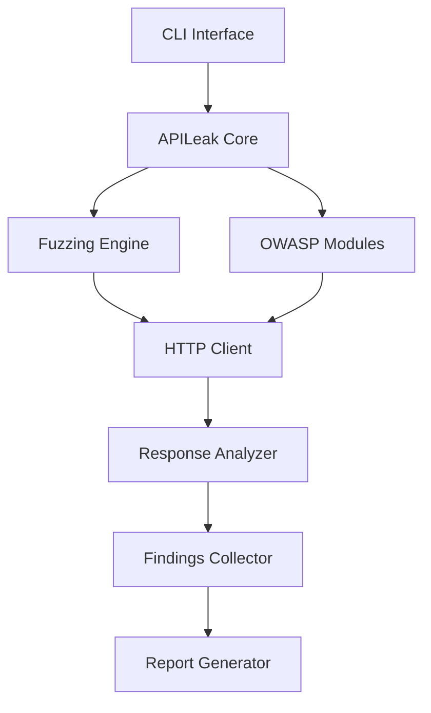
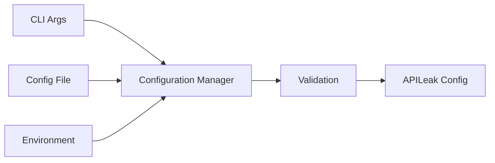
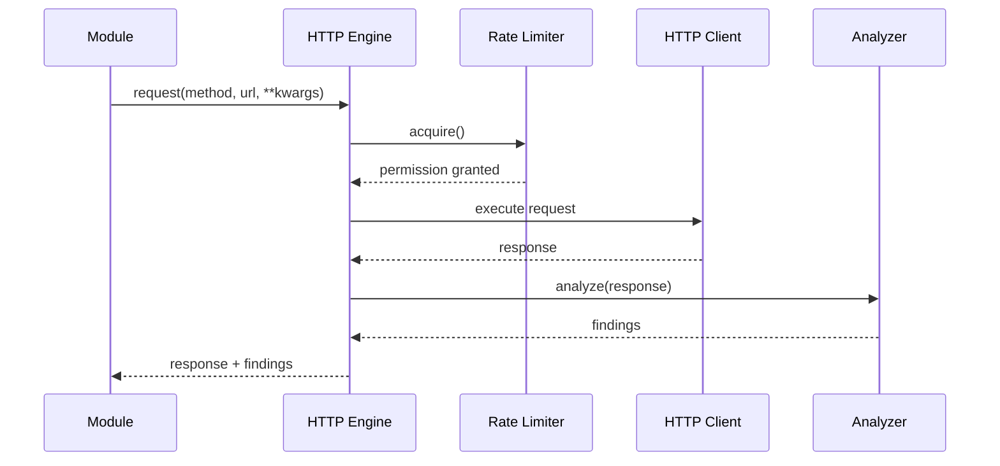
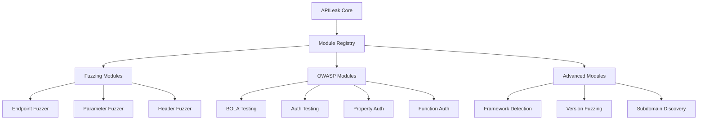

# 🏗️ APILeak Architecture

This document provides a comprehensive overview of APILeak's system architecture, design patterns, and component interactions.

## System Overview

APILeak follows a modular, plugin-based architecture designed for extensibility, maintainability, and performance. The system is built around a core engine that orchestrates various specialized modules for different types of security testing.



## Core Components

### 1. CLI Interface (`apileaks.py`)
- **Purpose**: Command-line interface and entry point
- **Responsibilities**:
  - Parse command-line arguments
  - Load and validate configuration
  - Initialize the core engine
  - Handle user interactions and output

### 2. APILeak Core (`core/engine.py`)
- **Purpose**: Main orchestrator and coordinator
- **Responsibilities**:
  - Manage scan lifecycle
  - Coordinate between modules
  - Aggregate results
  - Handle error recovery

### 3. Fuzzing Engine (`modules/fuzzing/`)
- **Purpose**: Traditional fuzzing operations
- **Components**:
  - **Endpoint Fuzzer**: Directory and endpoint discovery
  - **Parameter Fuzzer**: Query and body parameter testing
  - **Header Fuzzer**: HTTP header manipulation
- **Responsibilities**:
  - Execute fuzzing campaigns
  - Discover attack surface
  - Generate test payloads

### 4. OWASP Modules (`modules/owasp/`)
- **Purpose**: OWASP API Security Top 10 testing
- **Components**:
  - **BOLA Testing**: Broken Object Level Authorization
  - **Auth Testing**: Authentication vulnerabilities
  - **Property Auth**: Property-level authorization
  - **Function Auth**: Function-level authorization
  - **Resource Testing**: Resource consumption attacks
  - **SSRF Testing**: Server-Side Request Forgery

### 5. HTTP Client (`utils/http_client.py`)
- **Purpose**: Advanced HTTP request handling
- **Features**:
  - Async HTTP client with connection pooling
  - Adaptive rate limiting
  - Retry logic with exponential backoff
  - User agent rotation for WAF evasion
  - Colored HTTP output with status filtering
  - Authentication context management

### 6. Response Analyzer (`utils/response_analyzer.py`)
- **Purpose**: Analyze HTTP responses for vulnerabilities
- **Responsibilities**:
  - Parse response content
  - Identify security indicators
  - Extract metadata
  - Classify response types

### 7. Findings Collector (`utils/findings.py`)
- **Purpose**: Centralized finding management
- **Features**:
  - Automatic severity classification
  - OWASP categorization
  - Deduplication
  - Statistical analysis

### 8. Report Generator (`utils/report_generator.py`)
- **Purpose**: Generate security reports
- **Formats**:
  - JSON (machine-readable)
  - HTML (human-readable)
  - XML (structured data)
  - TXT (plain text)

## Detailed Architecture

### Configuration Management



The configuration system supports multiple sources with precedence:
1. Command-line arguments (highest priority)
2. Configuration files (YAML/JSON)
3. Environment variables (lowest priority)

### HTTP Request Flow



### Module Plugin System



## Design Patterns

### 1. Strategy Pattern
Used for different fuzzing strategies and authentication methods:
- **Context**: HTTP Engine
- **Strategies**: Different authentication types (Bearer, Basic, API Key, JWT)
- **Benefits**: Easy to add new authentication methods

### 2. Observer Pattern
Used for findings collection and reporting:
- **Subject**: Scan execution
- **Observers**: Findings collector, progress reporter
- **Benefits**: Decoupled reporting and analysis

### 3. Factory Pattern
Used for creating different types of modules:
- **Factory**: Module factory
- **Products**: OWASP modules, fuzzing modules
- **Benefits**: Consistent module creation and initialization

### 4. Command Pattern
Used for CLI interface:
- **Commands**: dir, par, full, jwt (with subcommands: decode, encode, test-alg-none, test-null-signature, brute-secret, test-kid-injection, test-jwks-spoof, test-inline-jwks)
- **Benefits**: Easy to add new commands and maintain consistency

## Data Flow

### 1. Initialization Phase
```
CLI Input → Configuration Loading → Core Engine Initialization → Module Registration
```

### 2. Discovery Phase
```
Target Analysis → Endpoint Discovery → Framework Detection → Version Mapping
```

### 3. Testing Phase
```
Fuzzing Execution → OWASP Testing → Advanced Discovery → Finding Collection
```

### 4. Reporting Phase
```
Result Aggregation → Severity Classification → Report Generation → Output
```

## Performance Considerations

### Async Architecture
- **HTTP Client**: Fully asynchronous using `httpx`
- **Concurrency**: Controlled via semaphores and rate limiting
- **Connection Pooling**: Reuse connections for better performance

### Rate Limiting
- **Token Bucket Algorithm**: Smooth rate limiting
- **Adaptive Throttling**: Automatic adjustment based on server responses
- **Retry-After Respect**: Honor server rate limiting headers

### Memory Management
- **Streaming**: Large responses handled via streaming
- **Garbage Collection**: Explicit cleanup of large objects
- **Connection Limits**: Prevent resource exhaustion

## Security Considerations

### Input Validation
- **URL Validation**: Prevent SSRF in target URLs
- **Payload Sanitization**: Safe handling of user inputs
- **File Path Validation**: Prevent directory traversal

### Output Sanitization
- **Report Generation**: Escape HTML/XML content
- **Log Output**: Prevent log injection
- **Terminal Output**: Safe ANSI code handling

### Authentication
- **Token Storage**: Secure handling of authentication tokens
- **Context Isolation**: Separate authentication contexts
- **Credential Rotation**: Support for token refresh

## Extensibility

### Adding New Modules

1. **Create Module Class**:
```python
class CustomModule(BaseModule):
    async def execute_tests(self, endpoints):
        # Implementation
        pass
```

2. **Register Module**:
```python
core.register_owasp_module("custom", CustomModule(config, http_client))
```

3. **Configuration**:
```yaml
owasp_testing:
  enabled_modules: ["custom"]
  custom_testing:
    enabled: true
    # Custom configuration
```

### Adding New Report Formats

1. **Create Formatter**:
```python
class CustomFormatter(BaseFormatter):
    def format(self, results):
        # Implementation
        pass
```

2. **Register Formatter**:
```python
report_generator.register_formatter("custom", CustomFormatter())
```

## Testing Architecture

### Unit Tests
- **Module Testing**: Individual module functionality
- **Integration Testing**: Module interactions
- **HTTP Client Testing**: Request/response handling

### Property-Based Testing
- **Hypothesis Integration**: Automated test case generation
- **Correctness Properties**: Formal specification validation
- **Edge Case Discovery**: Automatic boundary testing

### Performance Testing
- **Load Testing**: High-volume request handling
- **Memory Profiling**: Resource usage analysis
- **Concurrency Testing**: Race condition detection

## Monitoring and Observability

### Structured Logging
- **JSON Format**: Machine-readable logs
- **Context Propagation**: Request tracing
- **Log Levels**: Configurable verbosity

### Metrics Collection
- **Performance Metrics**: Response times, success rates
- **Business Metrics**: Findings count, coverage
- **System Metrics**: Memory usage, connection counts

### Health Checks
- **Component Health**: Individual module status
- **Dependency Health**: External service availability
- **Overall Health**: System readiness

## Deployment Considerations

### Container Support
- **Docker Images**: Multi-stage builds for optimization
- **Environment Configuration**: Container-friendly config
- **Resource Limits**: Proper resource allocation

### CI/CD Integration
- **Exit Codes**: Meaningful return codes for automation
- **JSON Output**: Machine-readable results
- **Parallel Execution**: Support for distributed scanning

### Scalability
- **Horizontal Scaling**: Multiple scanner instances
- **Load Distribution**: Target-based partitioning
- **Result Aggregation**: Centralized finding collection

---

This architecture provides a solid foundation for enterprise-grade API security testing while maintaining flexibility for future enhancements and customizations.