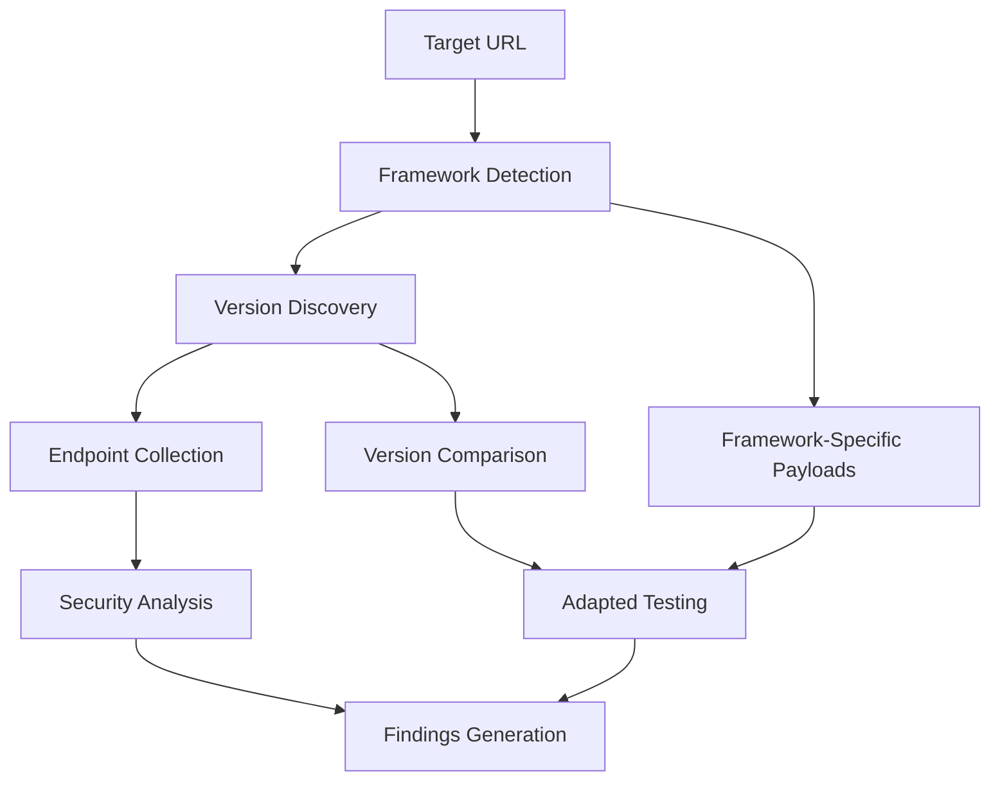

# Framework Detection y API Version Fuzzing

## Descripción General

APILeak v0.1.0 incluye capacidades avanzadas de detección de frameworks y fuzzing de versiones de API que permiten identificar tecnologías específicas y mapear diferentes versiones de APIs para un análisis de seguridad más completo.

## Framework Detection

### Descripción

El módulo de detección de frameworks identifica automáticamente las tecnologías utilizadas por la API objetivo, permitiendo adaptar las pruebas de seguridad según el framework específico detectado.

### Frameworks Soportados

- **FastAPI** - Framework Python moderno para APIs
- **Express.js** - Framework Node.js popular
- **Django** - Framework web Python completo
- **Flask** - Microframework Python ligero
- **Spring Boot** - Framework Java empresarial
- **ASP.NET** - Framework Microsoft .NET
- **Ruby on Rails** - Framework Ruby completo
- **Laravel** - Framework PHP moderno

### Métodos de Detección

1. **Análisis de Headers HTTP**
   - `Server`: Identifica servidores web y frameworks
   - `X-Powered-By`: Headers específicos de frameworks
   - `X-AspNet-Version`: Versiones específicas de ASP.NET

2. **Patrones de Mensajes de Error**
   - Mensajes de error característicos de cada framework
   - Stack traces específicos
   - Páginas de error por defecto

3. **Análisis de Contenido de Respuesta**
   - Patrones específicos en el HTML/JSON
   - Cookies y tokens característicos
   - Estructuras de respuesta típicas

4. **Endpoints por Defecto**
   - `/docs`, `/redoc` para FastAPI
   - `/admin/` para Django
   - `/actuator` para Spring Boot
   - `/swagger` para varios frameworks

### Configuración

```yaml
advanced_discovery:
  framework_detection:
    enabled: true
    adapt_payloads: true
    test_framework_endpoints: true
    max_error_requests: 5
    timeout: 10.0
    confidence_threshold: 0.6
```

### Uso desde CLI

```bash
# Habilitar detección de frameworks
python apileaks.py full --target https://api.example.com --detect-framework

# Usar flag corto
python apileaks.py full --target https://api.example.com --df

# Configurar umbral de confianza
python apileaks.py full --target https://api.example.com --df --framework-confidence 0.8

# Combinar con fuzzing de directorios
python apileaks.py dir --target https://api.example.com --df
```

### Payloads Específicos por Framework

Una vez detectado el framework, APILeak genera automáticamente payloads específicos:

#### FastAPI
- Inyección de modelos Pydantic
- Manipulación de especificaciones OpenAPI
- Condiciones de carrera en endpoints async

#### Express.js
- Contaminación de prototipos
- Path traversal via express.static
- Vulnerabilidades del body parser

#### Django
- Inyección de templates Django
- Bypass de tokens CSRF
- Inyección SQL via ORM

#### Flask
- Inyección de templates Jinja2
- Bypass del debugger Werkzeug
- Manipulación de cookies de sesión

#### Spring Boot
- Inyección de Spring Expression Language (SpEL)
- Exposición de endpoints Actuator
- Vulnerabilidades de deserialización

#### ASP.NET
- Manipulación de ViewState
- Bypass de validación de requests
- Ataques de deserialización

## API Version Fuzzing

### Descripción

El módulo de fuzzing de versiones de API descubre automáticamente diferentes versiones de la API objetivo y compara sus endpoints para identificar inconsistencias de seguridad y funcionalidades específicas por versión.

### Patrones de Versiones Soportados

- `/v1`, `/v2`, `/v3`, `/v4`, `/v5`
- `/api/v1`, `/api/v2`, `/api/v3`, `/api/v4`, `/api/v5`
- `/api/1`, `/api/2`, `/api/3`
- `/1`, `/2`, `/3`
- `/version1`, `/version2`, `/version3`
- `/ver1`, `/ver2`, `/ver3`

### Funcionalidades

1. **Descubrimiento de Versiones**
   - Prueba patrones comunes de versionado
   - Identifica versiones accesibles
   - Determina el estado de cada versión (activa, deprecada, desarrollo)

2. **Análisis de Endpoints**
   - Prueba endpoints comunes en cada versión
   - Compara disponibilidad entre versiones
   - Identifica endpoints únicos por versión

3. **Detección de Estado**
   - **Activa**: Versión en producción normal
   - **Deprecada**: Versión marcada como obsoleta
   - **Desarrollo**: Versión beta o experimental

4. **Comparación de Versiones**
   - Endpoints comunes entre todas las versiones
   - Endpoints únicos por versión
   - Diferencias de funcionalidad

### Configuración

```yaml
advanced_discovery:
  version_fuzzing:
    enabled: true
    version_patterns:
      - "/v1"
      - "/v2"
      - "/api/v1"
      - "/api/v2"
    test_endpoints:
      - "/"
      - "/health"
      - "/status"
      - "/info"
      - "/docs"
    max_concurrent_requests: 5
    timeout: 10.0
    compare_endpoints: true
    detect_deprecated: true
```

### Uso desde CLI

```bash
# Habilitar fuzzing de versiones
python apileaks.py full --target https://api.example.com --fuzz-versions

# Usar flag corto
python apileaks.py full --target https://api.example.com --fv

# Patrones personalizados
python apileaks.py full --target https://api.example.com --fv --version-patterns "/v1,/v2,/api/v1"

# Combinar con detección de frameworks
python apileaks.py full --target https://api.example.com --df --fv

# Solo en modo directorio
python apileaks.py dir --target https://api.example.com --fv
```

## Integración con Advanced Discovery Engine

Ambos módulos se integran en el **Advanced Discovery Engine** que orquesta:

1. **Detección de Frameworks** (Fase 1)
2. **Descubrimiento de Versiones** (Fase 2)
3. **Descubrimiento de Subdominios** (Fase 3)
4. **Análisis CORS** (Fase 4)
5. **Análisis de Security Headers** (Fase 5)

### Flujo de Trabajo



## Findings y Reportes

### Tipos de Findings

#### Framework Detection
- **INFO**: Framework detectado con confianza
- **MEDIUM**: Framework con vulnerabilidades conocidas

#### Version Fuzzing
- **INFO**: Múltiples versiones descubiertas
- **MEDIUM**: Versiones deprecadas accesibles
- **HIGH**: Versiones de desarrollo en producción
- **LOW**: Diferencias significativas entre versiones

### Ejemplo de Salida

```
🎯 Target: https://api.example.com
🔍 Framework Detection: Enabled (confidence: 0.6)
📊 Version Fuzzing: Enabled
⚡ Rate Limit: 10 req/sec

Framework Detection Results:
✓ Framework detected: Flask
  Confidence: 0.95
  Detection method: headers, error_patterns
  Vulnerabilities: 4
  Framework-specific payloads: 5

Version Discovery Results:
✓ Version discovery completed
  Versions found: 3
  - v1: active (accessible: true)
    Endpoints: 5
  - v2: active (accessible: true)
    Endpoints: 8
  - v3: development (accessible: true)
    Endpoints: 3

Findings Generated:
✓ Framework Detection: 2 findings
✓ Version Analysis: 1 finding (development version in production)
```

## Configuración Avanzada

### Archivo de Configuración YAML

```yaml
target:
  base_url: "https://api.example.com"
  timeout: 10
  verify_ssl: true

advanced_discovery:
  framework_detection:
    enabled: true
    adapt_payloads: true
    test_framework_endpoints: true
    max_error_requests: 5
    timeout: 10.0
    confidence_threshold: 0.6
  
  version_fuzzing:
    enabled: true
    version_patterns:
      - "/v1"
      - "/v2"
      - "/v3"
      - "/api/v1"
      - "/api/v2"
      - "/api/v3"
    test_endpoints:
      - "/"
      - "/health"
      - "/status"
      - "/info"
      - "/docs"
      - "/swagger"
    max_concurrent_requests: 5
    timeout: 10.0
    compare_endpoints: true
    detect_deprecated: true

rate_limiting:
  requests_per_second: 10
  burst_size: 20
  adaptive: true

reporting:
  formats: ["json", "html", "txt"]
  output_dir: "reports"
```

### Variables de Entorno

```bash
# Configuración básica
export APILEAK_TARGET="https://api.example.com"
export APILEAK_RATE_LIMIT="5"
export APILEAK_TIMEOUT="15"

# Framework detection
export APILEAK_DETECT_FRAMEWORK="true"
export APILEAK_FRAMEWORK_CONFIDENCE="0.7"

# Version fuzzing
export APILEAK_FUZZ_VERSIONS="true"
export APILEAK_VERSION_PATTERNS="/v1,/v2,/api/v1,/api/v2"
```

## Casos de Uso

### 1. Reconocimiento Inicial
```bash
# Identificar tecnología y versiones disponibles
python apileaks.py full --target https://api.example.com --df --fv
```

### 2. Testing Específico por Framework
```bash
# Detectar framework y usar payloads específicos
python apileaks.py full --target https://api.example.com --df --framework-confidence 0.8
```

### 3. Análisis de Versiones Legacy
```bash
# Buscar versiones deprecadas o de desarrollo
python apileaks.py dir --target https://api.example.com --fv --version-patterns "/v1,/v2,/legacy,/beta"
```

### 4. Integración en CI/CD
```bash
# Verificar que no hay versiones de desarrollo expuestas
python apileaks.py full --target $API_URL --fv --rate-limit 5 --json-logs
```

## Mejores Prácticas

### Framework Detection
1. **Usar umbral de confianza apropiado**: 0.6-0.8 para balance entre precisión y cobertura
2. **Combinar con fuzzing**: Usar `--df` junto con `dir` o `full` para mejor contexto
3. **Revisar payloads específicos**: Los payloads se adaptan automáticamente al framework detectado

### Version Fuzzing
1. **Patrones personalizados**: Usar `--version-patterns` para APIs con esquemas específicos
2. **Monitorear versiones deprecadas**: Alertar sobre versiones que deberían estar deshabilitadas
3. **Comparar funcionalidad**: Revisar diferencias entre versiones para inconsistencias de seguridad

### Rendimiento
1. **Rate limiting**: Usar `--rate-limit` apropiado para evitar sobrecargar el servidor
2. **Timeouts**: Configurar timeouts según la latencia del objetivo
3. **Concurrencia**: Ajustar `max_concurrent_requests` según la capacidad del servidor

## Troubleshooting

### Problemas Comunes

1. **Framework no detectado**
   - Reducir `--framework-confidence`
   - Verificar que el target responde correctamente
   - Revisar logs con `--log-level DEBUG`

2. **Versiones no encontradas**
   - Usar patrones personalizados con `--version-patterns`
   - Verificar conectividad al target
   - Aumentar timeout si la red es lenta

3. **Rate limiting del servidor**
   - Reducir `--rate-limit`
   - Usar `--user-agent-random` para evasión
   - Implementar delays entre requests

### Logs de Debug

```bash
# Habilitar logs detallados
python apileaks.py full --target https://api.example.com --df --fv --log-level DEBUG --log-file debug.log
```

## Roadmap

### Funcionalidades Futuras

1. **Más Frameworks**
   - Soporte para Gin (Go)
   - Soporte para Rocket (Rust)
   - Soporte para Phoenix (Elixir)

2. **Detección Avanzada**
   - Machine learning para detección
   - Fingerprinting de versiones específicas
   - Detección de microservicios

3. **Integración Mejorada**
   - Plugins para frameworks específicos
   - Reportes especializados por tecnología
   - Recomendaciones automáticas de seguridad

## Referencias

- [OWASP API Security Top 10](https://owasp.org/www-project-api-security/)
- [Framework Security Guides](https://cheatsheetseries.owasp.org/)
- [API Versioning Best Practices](https://restfulapi.net/versioning/)