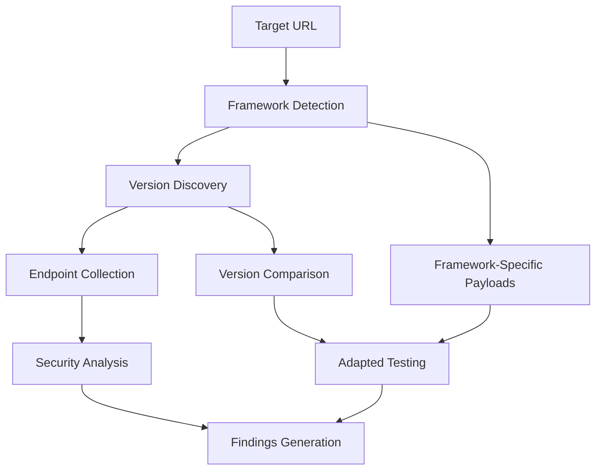

# Framework Detection and API Version Fuzzing

## Overview

APILeak v0.1.0 includes advanced framework detection and API version fuzzing capabilities that allow identifying specific technologies and mapping different API versions for more comprehensive security analysis.

## Framework Detection

### Description

The framework detection module automatically identifies the technologies used by the target API, allowing security tests to be adapted according to the specific detected framework.

### Supported Frameworks

- **FastAPI** - Modern Python framework for APIs
- **Express.js** - Popular Node.js framework
- **Django** - Complete Python web framework
- **Flask** - Lightweight Python microframework
- **Spring Boot** - Enterprise Java framework
- **ASP.NET** - Microsoft .NET framework
- **Ruby on Rails** - Complete Ruby framework
- **Laravel** - Modern PHP framework

### Detection Methods

1. **HTTP Headers Analysis**
   - `Server`: Identifies web servers and frameworks
   - `X-Powered-By`: Framework-specific headers
   - `X-AspNet-Version`: ASP.NET specific versions

2. **Error Message Patterns**
   - Characteristic error messages from each framework
   - Specific stack traces
   - Default error pages

3. **Response Content Analysis**
   - Specific patterns in HTML/JSON
   - Characteristic cookies and tokens
   - Typical response structures

4. **Default Endpoints**
   - `/docs`, `/redoc` for FastAPI
   - `/admin/` for Django
   - `/actuator` for Spring Boot
   - `/swagger` for various frameworks

### Configuration

```yaml
advanced_discovery:
  framework_detection:
    enabled: true
    adapt_payloads: true
    test_framework_endpoints: true
    max_error_requests: 5
    timeout: 10.0
    confidence_threshold: 0.6
```

### CLI Usage

```bash
# Enable framework detection
python apileaks.py full --target https://api.example.com --detect-framework

# Use short flag
python apileaks.py full --target https://api.example.com --df

# Configure confidence threshold
python apileaks.py full --target https://api.example.com --df --framework-confidence 0.8

# Combine with directory fuzzing
python apileaks.py dir --target https://api.example.com --df
```

### Framework-Specific Payloads

Once the framework is detected, APILeak automatically generates specific payloads:

#### FastAPI
- Pydantic model injection
- OpenAPI specification manipulation
- Race conditions in async endpoints

#### Express.js
- Prototype pollution
- Path traversal via express.static
- Body parser vulnerabilities

#### Django
- Django template injection
- CSRF token bypass
- SQL injection via ORM

#### Flask
- Jinja2 template injection
- Werkzeug debugger bypass
- Session cookie manipulation

#### Spring Boot
- Spring Expression Language (SpEL) injection
- Actuator endpoint exposure
- Deserialization vulnerabilities

#### ASP.NET
- ViewState manipulation
- Request validation bypass
- Deserialization attacks

## API Version Fuzzing

### Description

The API version fuzzing module automatically discovers different versions of the target API and compares their endpoints to identify security inconsistencies and version-specific functionality.

### Supported Version Patterns

- `/v1`, `/v2`, `/v3`, `/v4`, `/v5`
- `/api/v1`, `/api/v2`, `/api/v3`, `/api/v4`, `/api/v5`
- `/api/1`, `/api/2`, `/api/3`
- `/1`, `/2`, `/3`
- `/version1`, `/version2`, `/version3`
- `/ver1`, `/ver2`, `/ver3`

### Features

1. **Version Discovery**
   - Tests common versioning patterns
   - Identifies accessible versions
   - Determines the status of each version (active, deprecated, development)

2. **Endpoint Analysis**
   - Tests common endpoints in each version
   - Compares availability between versions
   - Identifies unique endpoints per version

3. **Status Detection**
   - **Active**: Version in normal production
   - **Deprecated**: Version marked as obsolete
   - **Development**: Beta or experimental version

4. **Version Comparison**
   - Common endpoints across all versions
   - Unique endpoints per version
   - Functionality differences

### Configuration

```yaml
advanced_discovery:
  version_fuzzing:
    enabled: true
    version_patterns:
      - "/v1"
      - "/v2"
      - "/api/v1"
      - "/api/v2"
    test_endpoints:
      - "/"
      - "/health"
      - "/status"
      - "/info"
      - "/docs"
    max_concurrent_requests: 5
    timeout: 10.0
    compare_endpoints: true
    detect_deprecated: true
```

### CLI Usage

```bash
# Enable version fuzzing
python apileaks.py full --target https://api.example.com --fuzz-versions

# Use short flag
python apileaks.py full --target https://api.example.com --fv

# Custom patterns
python apileaks.py full --target https://api.example.com --fv --version-patterns "/v1,/v2,/api/v1"

# Combine with framework detection
python apileaks.py full --target https://api.example.com --df --fv

# Directory mode only
python apileaks.py dir --target https://api.example.com --fv
```

## Integration with Advanced Discovery Engine

Both modules integrate into the **Advanced Discovery Engine** which orchestrates:

1. **Framework Detection** (Phase 1)
2. **Version Discovery** (Phase 2)
3. **Subdomain Discovery** (Phase 3)
4. **CORS Analysis** (Phase 4)
5. **Security Headers Analysis** (Phase 5)

### Workflow



## Findings and Reports

### Finding Types

#### Framework Detection
- **INFO**: Framework detected with confidence
- **MEDIUM**: Framework with known vulnerabilities

#### Version Fuzzing
- **INFO**: Multiple versions discovered
- **MEDIUM**: Deprecated versions accessible
- **HIGH**: Development versions in production
- **LOW**: Significant differences between versions

### Example Output

```
🎯 Target: https://api.example.com
🔍 Framework Detection: Enabled (confidence: 0.6)
📊 Version Fuzzing: Enabled
⚡ Rate Limit: 10 req/sec

Framework Detection Results:
✓ Framework detected: Flask
  Confidence: 0.95
  Detection method: headers, error_patterns
  Vulnerabilities: 4
  Framework-specific payloads: 5

Version Discovery Results:
✓ Version discovery completed
  Versions found: 3
  - v1: active (accessible: true)
    Endpoints: 5
  - v2: active (accessible: true)
    Endpoints: 8
  - v3: development (accessible: true)
    Endpoints: 3

Findings Generated:
✓ Framework Detection: 2 findings
✓ Version Analysis: 1 finding (development version in production)
```

## Advanced Configuration

### YAML Configuration File

```yaml
target:
  base_url: "https://api.example.com"
  timeout: 10
  verify_ssl: true

advanced_discovery:
  framework_detection:
    enabled: true
    adapt_payloads: true
    test_framework_endpoints: true
    max_error_requests: 5
    timeout: 10.0
    confidence_threshold: 0.6
  
  version_fuzzing:
    enabled: true
    version_patterns:
      - "/v1"
      - "/v2"
      - "/v3"
      - "/api/v1"
      - "/api/v2"
      - "/api/v3"
    test_endpoints:
      - "/"
      - "/health"
      - "/status"
      - "/info"
      - "/docs"
      - "/swagger"
    max_concurrent_requests: 5
    timeout: 10.0
    compare_endpoints: true
    detect_deprecated: true

rate_limiting:
  requests_per_second: 10
  burst_size: 20
  adaptive: true

reporting:
  formats: ["json", "html", "txt"]
  output_dir: "reports"
```

### Environment Variables

```bash
# Basic configuration
export APILEAK_TARGET="https://api.example.com"
export APILEAK_RATE_LIMIT="5"
export APILEAK_TIMEOUT="15"

# Framework detection
export APILEAK_DETECT_FRAMEWORK="true"
export APILEAK_FRAMEWORK_CONFIDENCE="0.7"

# Version fuzzing
export APILEAK_FUZZ_VERSIONS="true"
export APILEAK_VERSION_PATTERNS="/v1,/v2,/api/v1,/api/v2"
```

## Use Cases

### 1. Initial Reconnaissance
```bash
# Identify technology and available versions
python apileaks.py full --target https://api.example.com --df --fv
```

### 2. Framework-Specific Testing
```bash
# Detect framework and use specific payloads
python apileaks.py full --target https://api.example.com --df --framework-confidence 0.8
```

### 3. Legacy Version Analysis
```bash
# Search for deprecated or development versions
python apileaks.py dir --target https://api.example.com --fv --version-patterns "/v1,/v2,/legacy,/beta"
```

### 4. CI/CD Integration
```bash
# Verify no development versions are exposed
python apileaks.py full --target $API_URL --fv --rate-limit 5 --json-logs
```

## Best Practices

### Framework Detection
1. **Use appropriate confidence threshold**: 0.6-0.8 for balance between precision and coverage
2. **Combine with fuzzing**: Use `--df` together with `dir` or `full` for better context
3. **Review specific payloads**: Payloads automatically adapt to detected framework

### Version Fuzzing
1. **Custom patterns**: Use `--version-patterns` for APIs with specific schemes
2. **Monitor deprecated versions**: Alert on versions that should be disabled
3. **Compare functionality**: Review differences between versions for security inconsistencies

### Performance
1. **Rate limiting**: Use appropriate `--rate-limit` to avoid overloading server
2. **Timeouts**: Configure timeouts according to target latency
3. **Concurrency**: Adjust `max_concurrent_requests` according to server capacity

## Troubleshooting

### Common Issues

1. **Framework not detected**
   - Reduce `--framework-confidence`
   - Verify target responds correctly
   - Review logs with `--log-level DEBUG`

2. **Versions not found**
   - Use custom patterns with `--version-patterns`
   - Verify connectivity to target
   - Increase timeout if network is slow

3. **Server rate limiting**
   - Reduce `--rate-limit`
   - Use `--user-agent-random` for evasion
   - Implement delays between requests

### Debug Logs

```bash
# Enable detailed logs
python apileaks.py full --target https://api.example.com --df --fv --log-level DEBUG --log-file debug.log
```

## Roadmap

### Future Features

1. **More Frameworks**
   - Support for Gin (Go)
   - Support for Rocket (Rust)
   - Support for Phoenix (Elixir)

2. **Advanced Detection**
   - Machine learning for detection
   - Specific version fingerprinting
   - Microservices detection

3. **Enhanced Integration**
   - Framework-specific plugins
   - Technology-specialized reports
   - Automatic security recommendations

## References

- [OWASP API Security Top 10](https://owasp.org/www-project-api-security/)
- [Framework Security Guides](https://cheatsheetseries.owasp.org/)
- [API Versioning Best Practices](https://restfulapi.net/versioning/)